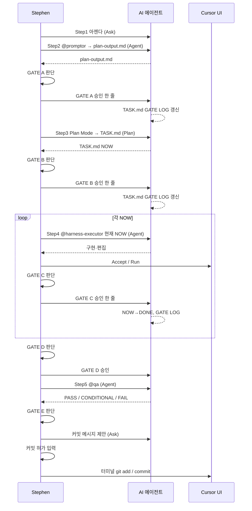
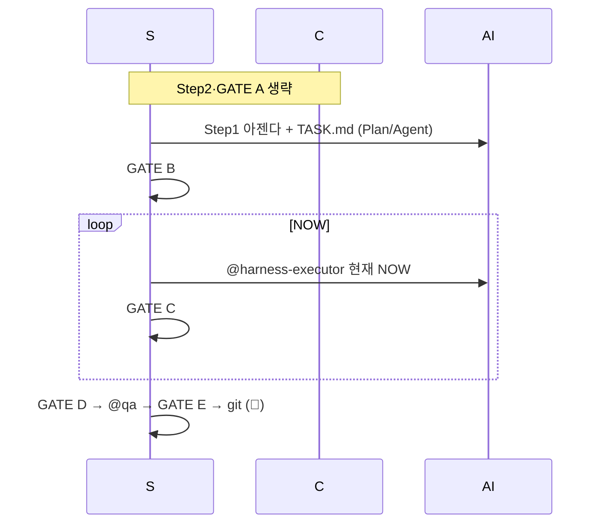

# Plannode 하네스 워크플로우 — 최종 가이드라인

> **Mermaid**: Cursor에서 `Markdown Preview Mermaid Support` 익스텐션 사용 시 다이어그램이 렌더됩니다(미리보기 `Ctrl+Shift+V`).

> **이 문서는** 1teamworks `harness-workflow_final.md`와 **동일한 뼈대(모드·GATE·복붙 규율)** 를 따르며, Plannode 저장소(`AGENTS.md`, `.cursor/harness/`, `.cursor/agents/harness-executor.md`) **실제 에이전트명**에 맞춰 둡니다. 타 프로젝트의 `@gsd-agent`에 해당하는 Step4는 Plannode에서는 **`@harness-executor`** 입니다.

---

## Plannode 전용 한 줄 요약

| 항목 | Plannode |
|------|----------|
| **제품·범위** | `.cursor/rules/plannode-prd.mdc` (M#·F#-#, IA≠AI, §10·§11) |
| **파일럿 정합** | `docs/PILOT_FUNCTIONAL_SPEC.md` §9~§10 |
| **Step2** | `@promptor` → `.cursor/harness/plan-output.md` |
| **Step3** | Plan Mode → `.cursor/harness/TASK.md` (NOW 30분 단위) |
| **Step4** | `@harness-executor` (GSD / GSD+)** — 결제·동시성 TDD는 본 PRD가 아닌 **일반 경로** |
| **Step5** | `@qa` — `.cursor/agents/qa.md` 단일 출처 |
| **git** | 👤 Stephen만 `git add` / `commit` / `push` |

---

## ⚠️ 1teamworks·공통에서 가져온 운영 원칙(요지)

| # | 원칙 |
|---|------|
| 1 | **GATE는 인간 판정** — 행에 AI 모델명을 “승인 조건”으로 박아 두지 않는다(세션 모델은 별도). |
| 2 | **GATE 기록은 🤖** — `TASK.md` **GATE LOG**는 AI가 갱신, Stephen이 직접 채우지 않는다(프로젝트 규칙과 동일). |
| 3 | **경량모드(※)** — 1teamworks **단축모드**와 같다: `@promptor`·GATE A 생략. `TASK.md` 상단에 `경량 경로: step2·GATE A 생략` 한 줄. |
| 4 | **GATE B·C·D만으로 커밋 자동 불가** — 반드시 채팅에 **「커밋 허가」** 등 최종 승인 후 터미널에서 커밋. |
| 5 | **GATE D ↔ Step5** — D는 “다음 단계 확정”; QA 루브릭·판정은 **`.cursor/agents/qa.md`** 가 단일 출처. |

---

## ① 모드 판별 (아젠다 작성 직후)

> 아래 **하나라도 해당** → **기본모드** (경량 불가)

| 판별 신호 | Plannode 예시 |
|-----------|----------------|
| DB · 스키마 · RLS | `plan_*` 테이블, 마이그레이션, PRD **§11** v2·path·`ai_generations` |
| 광범위·연쇄 | 4개 이상 파일, SvelteKit **스토어·캔버스 파이프라인** 동시 변경 |
| PRD v2 / LLM·4-레이어 | §10 LAYER1~, F2-5, `ContextSerializer` 도입, 모델 선택·파이프라인 |
| F2-4(IA/와이어) **신규 뷰·내보내기** 본격 | 트리→IA.md / 와이어 키트 **새 뷰** |
| 파일럿 갭 **다중** (§9) | 동시에 여러 갭 항목 수정 |

> **전부 해당 없음** + 단일목적·소수파일·경미한 변경 → **경량모드** 후보

```mermaid
flowchart TD
    A([아젠다 작성 완료]) --> B{DB·광범위·PRD v2·F2-4/F2-5\n다중갭?}
    B -->|YES| C([기본모드\n@promptor 포함])
    B -->|NO| D{단일목적·소수파일\n경미한 변경?}
    D -->|YES| E([경량모드\n@promptor 생략])
    D -->|NO| C
```

---

## ② 기본모드 (통상 경로)

### 전체 흐름



### 「모델」 열·Ask 행의 읽는 법 (1teamworks와 동일)

- **채팅 모드 Ask** + **이 행 전용 모델: —** → 승인 문장 **한 턴**이면 되고, **상단에서 선택한 세션 모델**이 응답·GATE LOG 갱신을 수행한다.
- **GATE ≠ 특정 제품 모델 고정**; STEP2·4·5 **Agent** 실행 시에만 에이전트·Cursor 설정이 우선.

### 복붙 문장 — **G / R / W** (필독)

| 유형 | 뜻 |
|------|-----|
| **G** | **그대로** 복붙(맞춤법·따옴표·경로까지 문장에 포함된 그대로). |
| **R** | **`[대괄호]` 안만** 실제 값으로 치환, 나머지 G. |
| **W** | `…`·빈 줄·본인 한글만 — 고정 꼬리는 G. |

- **Step3(Plan Mode)** — Plan UI에는 **백틱 안 지시문만** 붙여넣기(필요 시 `Plan Mode:` 는 취향).

### 기본모드 단계별 실행표

| # | 유형 | 단계 | 채팅 모드 | 이 행 전용 모델 | 주체 | 복붙 문장 |
|---|------|------|-----------|------------------|------|-----------|
| 1 | W | **Step1 — 아젠다** | Ask | — | 👤 | `목표: …` `범위 밖: …` `PRD: M# F#-#(또는 생략)` `참고:` |
| 2 | G | **Step2 — @promptor** | Agent | (에이전트 설정) | 🤖 | `@promptor` 위 아젠다로 분석하고 `.cursor/harness/plan-output.md`에 저장. PRD 연계(§) 포함. **코드·커밋 금지.** — 에이전트: `.cursor/agents/promptor.md` |
| 3 | G/W | **GATE A** | Ask | — | 👤/🤖 | 승인 **G**: `GATE A 승인. Step3(Plan Mode) 진행.` / 수정 **W** / 반려 **W** |
| 4 | G | **Step3 — Plan Mode** | **Plan** | (Plan UI) | 🤖 | `plan-output.md(GATE A 확정)를 입력으로 .cursor/harness/TASK.md를 NOW/DONE 형태로. 태스크 30분 단위. PRD: 줄 유지.` |
| 5 | G/W | **GATE B** | Ask | — | 👤/🤖 | `GATE B 승인. @harness-executor 로 현재 NOW만.` / TASK 수동 수정 시 순서만 확인 |
| 6 | G | **Step4 — @harness-executor** | Agent | (에이전트 설정) | 🤖 | `@harness-executor` `.cursor/harness/TASK.md` **현재 NOW만**. 범위 밖 구현 금지. 끝나면 TASK·GSD_LOG·한 줄 요약. — `.cursor/agents/harness-executor.md` |
| 7 | G | **GATE C** (NOW마다) | Ask | — | 👤/🤖 | `GATE C 승인. 다음 NOW.` / 마지막: `GATE C 승인. 전부 끝. GATE D로.` |
| 8 | G | **GATE D** | Ask | — | 👤/🤖 | `GATE D 승인. @qa 검수 진행.` `변경 파일: [경로…]`(선택) |
| 9 | R | **Step5 — @qa** | Agent | (에이전트 설정) | 🤖 | `@qa` `변경 파일: [경로1] [경로2]` `절차: .cursor/agents/qa.md` `TASK·plan-output·plannode-prd(해당 시)` — **`[경로]`만 R** |
| 10 | G | **GATE E + 커밋** | Ask | — | 👤/🤖 | ① QA 결과 확인 ② `커밋 메시지 제안해줘` ③ `커밋 허가` ④ 터미널 `git add` / `git commit` — **git은 👤 직접** |

> **GATE D ↔ @qa** — D 승인 후 **즉시 Step5**; 도메인·PRD·파일럿갭·판정 포맷은 **qa.md**만 본다.

---

## ③ 경량모드 (1teamworks: 단축모드)

### 조건

- 단일 목적 · 소수 파일 · UI/버그
- **DB/RLS·PRD v2 대규모·F2-4 본 구현**에 손대지 않을 때(손대면 **기본모드**)

### 흐름 (요지)

- ❌ Step2·GATE A
- `TASK.md` **첫 줄**: `경량 경로: step2·GATE A 생략`
- Step4는 동일: **`@harness-executor` 현재 NOW**
- TDD/고위험이 **갑자기** 필요해지면 → **기본모드로 전환**, plan-output 보강(아래 ⑤)



### 경량 — 실행표(요지)

| # | 단계 | 비고 |
|---|------|------|
| 1 | 아젠다 + TASK NOW | 상단 `경량 경로` **G** 한 줄 |
| 2 | GATE B | `@harness-executor` **현재 NOW** |
| 3 | GATE C~E | 기본모드와 동일 |

---

## ④ 모드 비교 (한눈)

| 항목 | 기본모드 | 경량모드 |
|------|----------|----------|
| @promptor | 필수 | 생략 |
| plan-output | 필수 | 생략 |
| GATE A | 필수 | 생략 |
| Step4 | @harness-executor | 동일 |
| TDD(드물게) | §⑤ | **기본모드로 전환** |
| PRD | plan-output·TASK에 **PRD: M# F#-#** | 있으면 TASK에 1줄(권장) |

```mermaid
flowchart LR
  subgraph 기본
    S1[아젠다] --> S2[@promptor]
    S2 --> A[GATE A]
    A --> S3[Plan: TASK]
    S3 --> B[GATE B]
    B --> E[@harness-executor]
  end
  subgraph 경량
    L1[아젠다+TASK] --> B2[GATE B]
    B2 --> E
  end
```

---

## ⑤ 실행 모드: GSD / GSD+ / (선택) TDD

Plannode **기본**은 **GSD(30분)**·**GSD+**(캔버스·RLS·Supabase·store)이다. 1teamworks-style **TDD**는 Plannode에서 **예외**다.

- **GSD+ 트리거** — path·`ai_generations`·4-레이어, **고위험** PRD 키워드(§10.3) 등 → `@harness-executor`는 **GSD+ GATE C** 체크리스트 사용(에이전트 본문 참고).
- **TDD로 전환** — PRD **path 트리거 TDD**·`modelSelector`·`STATE_MACHINE` 등 **테스트가 요구**되는 작업: **경량이면 기본모드로 전환** → plan-output·TASK 정비 후 `RED → GREEN → REFACTOR`·**GATE C 묶음 금지** (1teamworks ⑤와 동일 정신).
- **@harness-executor** 첫 응답에 **고위험+테스트 필수**로 판정되면 — 프로젝트 **qa·AGENTS**와 맞게 **TDD/분해**를 제안; Stephen 승인 후 진행.

---

## ⑥ 커밋 프로세스

```mermaid
flowchart LR
    A[@qa 완료] --> B{판정}
    B -->|PASS| C[커밋 메시지 제안]
    B -->|CONDITIONAL| D[BACKLOG/범위 확인]
    B -->|FAIL| E[Step4 NOW 재구현]
    D --> C
    C --> F[커밋 허가]
    F --> G[GATE LOG]
    G --> H[👤 git commit]
```

> `GATE B/C/D`만으로 **커밋 자동 허가 아님**. **「커밋 허가」** 뒤 👤 터미널.

---

## ⑦ GATE 자동화 로드맵 (요지)

1. **Phase 1 (현재)** — 👤 판단 + 🤖 GATE LOG
2. **Phase 2** — 형식(NOW 30분·PRD 필드 존재) 자동 점검
3. **이후** — 경량+조건만 **부분 자동화** 검토
4. **영구 수동** — `git commit` / `git push` / **DB SQL 실행( Supabase/ psql )**

---

## ⑧ QA FAIL / CONDITIONAL / 토큰 (복붙) — @harness-executor 기준

> **G/W** 규율은 §「복붙」과 동일.

### A — QA **FAIL** → 동일 NOW 재구현 (1·2회)

**G+W** — `QA 지적:` 아래만 붙여넣기.

```text
# @harness-executor .cursor/harness/TASK.md QA FAIL이 난 NOW만 재구현. 아래 QA 지적만 반영. 범위 밖 구현 금지. 끝나면 TASK·GSD_LOG·한 줄 요약.

QA 지적:


```

- 동일 NOW **FAIL 3회** → `GATE B 소급`으로 NOW 재분해(아래 A-3).

### A-3 — FAIL 3회 — **GATE B 소급** (G)

```text
# GATE B 소급 요청. 동일 NOW 기준 QA FAIL이 3회입니다. .cursor/harness/TASK.md에서 해당 NOW를 재분해해줘.
```

### B — **CONDITIONAL** — BACKLOG 한 줄 (G+W)

```text
.cursor/harness/TASK.md 의 BACKLOG에 아래 한 줄을 추가해줘.

CONDITIONAL:


```

### C — 토큰 절약: NOW **3개**마다 **새 채팅** 권장 (G)

**C-1 — 새 스레드 첫 턴**

```text
# @harness-executor .cursor/harness/TASK.md 현재 미완료 NOW만. 이전 스레드 맥락은 무시. 범위 밖 구현 금지. 끝나면 TASK·GSD_LOG·한 줄 요약.
```

---

## ⑨ 기준 문서 맵 (Plannode)

| 경로 | 역할 |
|------|------|
| `AGENTS.md` | 정체성·GP·Step 순서·문서 위계 |
| `.cursor/rules/plannode-prd.mdc` | 제품 M/F/Phase, IA, §10~§11 |
| `docs/PILOT_FUNCTIONAL_SPEC.md` | 파일럿 분해, §9~§10 갭 |
| `.cursor/plans/PLANNODE_INTEGRATED_GUIDE.md` | Git·Supabase·Vercel·DNS |
| `.cursor/harness/README.md` | PRD 연계, DB 절 |
| `.cursor/harness/TASK.md` | NOW / GATE LOG |
| `.cursor/harness/plan-output.md` | @promptor 산출 |
| `.cursor/harness/context-hook.md` | 드리프트 훅 |
| `.cursor/agents/harness-executor.md` | Step4 |
| `.cursor/agents/promptor.md` | Step2 |
| `.cursor/agents/qa.md` | Step5 |
| **본 파일** | 워크플로우 **가이드라인**(1teamworks `harness-workflow_final` 대응) |

---

**문서 이력**

- 2026-04-23: Plannode `AGENTS`·`harness-executor`·`PRD 연계` 기준으로 **1teamworks `harness-workflow_final.md`와 유사 구조**로 최초 작성(저장소: `plannode` `.cursor/plans/`).
