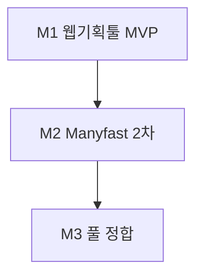
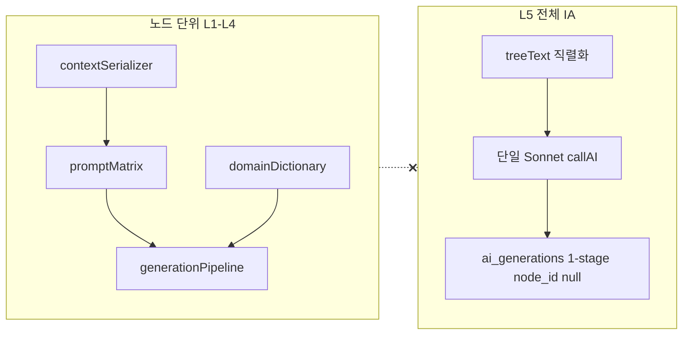
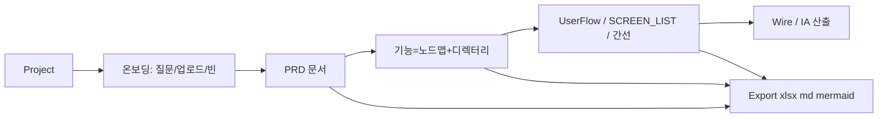

# Plannode AI: 결합 개발 로직 / Manyfast 핵심 정합 + L5·엑셀형 IA

> **v4 (저장소 정본).** · 파일: [.cursor/plans/plannode-ai-logic-v4.md](plannode-ai-logic-v4.md) — Cursor 항목 `plannode_ai_로직_정리_29459761`과 동기화.

## 문서 구조 (목차·읽는 순서)

| § | 제목 | 역할 |
|---|------|------|
| **1.1** | 마일스톤 M1~M3 | **분석 반영:** MVP 경계·범위 누수 방지·실현 가능한 업데이트 경로 |
| **1.2** | **하네스 정합·M1 완료/대기** | **TASK·GATE와 동기:** 구현 완료 귀결 vs 미완·문서갭·다음 NOW 규칙 (**이어서 실행할 때 필수**) |
| 1 | 두 문서 역할 | b084·v3·Manyfast·결합 원칙 |
| 2 | Frozen design | 스택·L1~L5·`ai_generations` |
| 3 | 엑셀형 IA (v3) | `OutputIntent` 3종·구현 루프 |
| **4.0** | **보기·출력 제품 정본** | 핵심정보 뷰 vs 다운로드·기능명세·IA 편집·xlsx·저장·와이어 MD·**사용자 라벨「노드」** |
| **4.0.1** | **캔버스 노드 카드 재연결** | 3초 선택(모바일 터치)·`+` 드롭·단일 노드·그룹(서브트리)·`parent_id` |
| 4 | IA 메뉴·4.1 + **4.2 Manyfast 대응** | UI 배치 + 제품 기능 지도 |
| **4.3** | 4.2 **항목별** M1 / M2 / M3 | Manyfast 구간·산출 **단계 쪼개기(§1.1과 동기)** |
| **5.0** | M1 경계 | **MVP에 넣을 것 / 빼둘 것** |
| **5.0.1** | **M2 요구정의** | **plan-output·`TASK.md` NOW 한 줄**이 귀속할 **체크 가능 ID**·M3 경계 |
| **5.0.2** | **M3 요구정의** | M2 이후 **Manyfast 풀 정합**을 NOW로 쪼갤 **M3 전용 ID** |
| 5 | 권장 개발 순서 (b084) | 실행 순서(1~7); **5.0·5.0.1·5.0.2와 함께** 읽을 것 |
| 7 | IA 이후 PILOT UX 갭 | §9·§10·`ux-preview-gap-post-ia` |
| 8 | 선택: 트리 PNG / Mind Elixir | `optional-mind-elixir` |
| 9 | 정리 | 한 눈에 |

---

## 1.1 마일스톤 (분석 반영) — M1 / M2 / M3

> **판단 요지:** v4·Manyfast(4.2)는 **“웹서비스 개발·구축용 기획툴”로의 방향**은 충분하나, **4.2 전부를 한 번에 구현 = 범위 과다**다. `manyfast-core-parity`만으로는 **다제품 수준**이므로 **M1(최소 러너) → M2~M3(정합 확대)**로 나눈다.

| 단계 | 이름 | 목표 (제품 문장) | 대표 TODO |
|------|------|------------------|-----------|
| **M1** | **웹 기획툴 MVP** | `plan_nodes`+`ai_generations`+`treeText`+**L5 IA(표·Mermaid)**+PRD/ACL/callAI 경계로 **“노드맵 → IA·MD 산출”이 실서비스로 동작**; [PILOT](docs/PILOT_FUNCTIONAL_SPEC.md) **§7~9 갭**으로 **캔버스·탭·IA UX 신뢰** 확보 | `milestone-1-web-planning-mvp` + `align-db-l5` + `ia-excel-prompts` + `ia-menu-ui-placement` + `prd-f2-4-5` + `ux-preview-gap-post-ia`(M1 정의에 맞게 수행) |
| **M2** | **Manyfast 2차** | L2~L3 풀·PRD **미리보기 동기**·`optional-xlsx`·내보내기 메뉴 정리; 4.2 중 **기능(3계층)·디렉터리·검색** 본격화 | `foundation-l1-l2` 연계, `optional-xlsx`, 4.2 표 M2 열 |
| **M3** | **Manyfast 3차 / 풀 정합** | 온보딩(질문지·**파일 추출**), PRD **인라인·부분/전체 AI**, 유저플로 **전용+버전**, 와이어·**개발지시서** | `manyfast-core-parity` (잔여 4.2) |

**범위·리스크 (문서에 명시)**  
- **구현 공백:** §2의 과거 서술은 **§1.2.3 H4**로 리프레시 대기 — 현재 트리와 맞춰 읽을 것.  
- **운영:** 토큰·`callAI` 비용·업로드 스토리지는 M2~M3에서 정책·한도를 별도로 둔다.

---

## 1.2 하네스 정합 — M1 **완료 귀결** vs **대기(미완)·갭** (재구성)

> **목적:** `plan-output.md`(Step2·M1 고정)와 `TASK.md`(Step3·**GATE D까지 M1 마감**)가 **한 시점의 아젠다를 공유하지 않아** 하네스상 **이어 실행이 불가능**해진 문제를 본 절에서 **한 표로 고정**한다.  
> **진실 순위 (합의):** **①** `.cursor/harness/TASK.md` — `현재 아젠다`·`DONE`·`GATE LOG`·`NOW` · **②** 본 v4 §1.2·§5.0.1/5.0.2 · **③** `plan-output.md`(M2 착수 시 **반드시** 갱신 또는 대체 한 줄 부록).

> **뷰·출력(P-8) 후속:** [plan-output.md](../harness/plan-output.md) **P-8** · 소스 [뷰·출력_메뉴_재정립_8c32c88d.plan.md](뷰·출력_메뉴_재정립_8c32c88d.plan.md) — 👤 **GATE A(문서) ✓** → 👤 **GATE B**에서 코드·npm·저장 귀속 승인 · `TASK` **NOW-VO-*** / [BACKLOG-M2-뷰출력](../harness/TASK.md#backlog-m2-뷰출력)

### 1.2.1 왜 “기능 구현이 정상적이지 않다”고 느껴졌는지 (원인)

| # | 증상 | 조치(본 문서) |
|---|------|----------------|
| A | **아젠다 이중화:** Step2 `plan-output` = M1 범위 문구, Step3 `TASK` = M1 **GATE D 완료** — 동일 스프린트 ID·NOW 한 줄이 없음 | §1.2 표로 **완료/대기** 분리; M2부터는 **§5.0.1 ID**를 `TASK` NOW에 필수 병기 |
| B | **§5.0·P-3의 `path`** 등 DB 문구가 `TASK`·`DONE`에 **완료 ID로 없음** → 문서만 보면 M1 미완처럼 보임 | 아래 **대기 H1**으로 격리 — 적용 시 별도 NOW·SQL |
| C | **PILOT §9·수동 체크리스트**는 TASK에 ☑이나 **Stephen 수동 검증 기록·@qa 리포트**가 플랜에 없음 | **대기 H2** — 제품 신뢰는 `@qa`·검증 표로 확정 |
| D | v4 **§2 과거 시제**(예: `src/lib/ai` 공백·스텁 서술)가 **현재 트리와 어긋날 수 있음** | **대기 H3** — §2 Frozen design **리프레시** NOW |

### 1.2.2 M1 **구현 완료**로 귀결된 항목 (하네스·YAML과 동기 · 2026-04-26 기준)

| 구분 | 항목 | 근거 |
|------|------|------|
| YAML | `milestone-1-web-planning-mvp` · `align-db-l5` · `ia-excel-prompts` · `ia-menu-ui-placement` · `foundation-l1-l2` · `prd-f2-4-5` · `ux-preview-gap-post-ia` | 본 파일 frontmatter `todos` **completed** |
| TASK | M1-1 ~ M1-5, M1-L2 (`NEXT` 전부 `[x]`) | `.cursor/harness/TASK.md` |
| GATE | GATE C(M1-1~5·전체) · **GATE D(M1 마감)** | `TASK.md` **GATE LOG** |
| DB | `docs/supabase/plannode_ai_generations.sql` + **Supabase 적용 완료** | `TASK.md` DONE·BLOCKED 해제 |
| 제품 | L5 IA 3종·`IAExportMenu`·`treeText` SSoT·`callAI`/meta·`modelSelector`·**nodes↔파일럿 동기·IA UX**(M1-5) | 구현 요지·`TASK.md` DONE |

→ 위 표 범위를 **“M1 기능 구현 완료(귀결)”**로 규정한다. **이 범위 밖**은 아래 **대기** 또는 **M2/M3**다.

### 1.2.3 **대기·미완·문서–구현 갭** (다음에 잡을 작업 — NOW 후보)

| ID | 상태 | 내용 | 다음 액션 |
|----|------|------|-----------|
| **H1** | 대기 | **§5.0 / plan-output P-3**의 **`plan_nodes.path`(또는 PRD §11 path)** — 레포에 **전용 완료 SQL·TASK NOW 한 줄 없음** | SQL·마이그레이션 신규(GP-4) + `TASK` NOW `PRD: M3 F3-2` 등 명시 |
| **H2** | 대기 | **PILOT §9~§10** 전 항목 **수동·@qa 검증 결과**가 문서/이슈에 **미기록** | `@qa` Step5 또는 `TASK` 수동 검증 표 **채움** → CONDITIONAL/FAIL 시 수정 NOW |
| **H3** | 대기 | **`plan-output.md` M1 스냅샷** — M1 **GATE D**·M2 예고가 본문에 없음 | `plan-output` **P-1 아젠다 한 줄** 갱신 또는 “§1.2만 참조” 부속 문구 |
| **H4** | 대기 | **§2 Frozen design** 서술이 **현 코드와 불일치**할 수 있음(구현 공백·스텁 등 과거 문장) | §2 **읽기 전용 리프레시** NOW (코드 인용만, 기능 변경 없음 가능) |
| **M2** | 대기 | §**5.0.1** ID 전부 (`M2-PRD-SYNC` …) | M2 첫 스프린트: **GATE B** → `TASK` NOW에 **`v4 §5.0.1 <ID>`** 필수 |
| **M3** | 대기 | §**5.0.2** ID 전부 | M2 완료 후 동일 규칙 |
| **선택** | 대기 | `optional-xlsx` · `optional-mind-elixir` · L4 `domainDictionary` | `TASK.md` **BACKLOG-M1**과 동일 — 별도 GATE B |
| **VO** | 문서 ✓ / 코드 대기 | **뷰·출력 메뉴 재정립** — §**4.0**·**4.0.1**·`OutputIntent`·xlsx·그리드 저장 · `view-output-contract-v4` | 플랜 [뷰·출력_메뉴_재정립_8c32c88d.plan.md](뷰·출력_메뉴_재정립_8c32c88d.plan.md) · 👤 GATE A ✓ → **GATE B** 후 구현 · §**5.0.1** `M2-EXPORT-XLSX` / `M2-VIEW-SPEC-GRID` / `M2-VIEW-IA-GRID` |

### 1.2.4 **이어서 실행**할 때의 최소 규칙 (불일치 방지)

1. **`TASK.md`**에 `NOW:` **한 줄** — 반드시 **`v4 §5.0.1 <ID>`** 또는 **`v4 §5.0.2 <ID>`** (M2/M3) 또는 **`H1`~`H4`** 중 하나를 텍스트로 포함.  
2. **`plan-output.md`**는 Step2용이므로 M2 착수 전 **아젠다·M2 한 줄**을 갱신하거나, 갱신 전까지 **§1.2 + TASK만**을 아젠다로 본다.  
3. **PRD 절**이 걸리면 `plan-output` **P-4.5** 또는 `TASK`에 **`PRD: M#`** 한 줄을 추가한 뒤 `@qa`가 `.cursor/rules/plannode-prd.mdc`를 연다(`.cursor/agents/qa.md`).

---

## 1. 두 문서의 역할 (결합 기준)

| 문서 | 역할 | 이 계획에서의 쓰임 |
|------|------|-------------------|
| [plannode_ai_v2_고도화_b084b2b3.plan.md](file:///Users/stevenmac/.cursor/plans/plannode_ai_v2_고도화_b084b2b3.plan.md) | PRD·v2·v3를 한 실행축에 묶은 **로드맵 + YAML todos** (Phase, PRD F2-4/F2-5, DB·SvelteKit 이행) | **남은 작업**·**병렬 순서(2주차 L2∥L5)**의 단일 체크리스트 |
| [plannode-ai-enhancement-v3.md](plannode-ai-enhancement-v3.md) | L1~L5 **기술 명세** (타입, 직렬화, 프롬프트 문구, `iaExporter` 예시, 세션 2-B) | **IA “엑셀형” 상세(컬럼 정의, 표 예시)**·구현 단위(파일·호출 경로) |
| [Manyfast Docs — Plan / PRD / Features / Flow / Wire / Export](https://docs.manyfast.io/plan/plan) | **제품 기획 제품군(경쟁·참고)**—프로젝트~온보딩, PRD·3계층 기능·뷰, 플로·와이어, **xlsx/md/mermaid/개발지시서** | **Plannode 핵심 기능의 외부 기준(섹션 4.2)**·`manyfast-core-parity` — Velog·Lark 등 **타 벤치마크 비교 표는 이 플랜에서 제거** |

**결합 원칙:** b084·v3에 더해 **4.2 Manyfast 대응표**가 “무엇을 갖출지”의 **최우선 제품·기능** 정의. PRD의 `IA_SITEMAP` 등과 v3 `IA_STRUCTURE`/`SCREEN_LIST`/`FUNCTIONAL_SPEC`·b084 용어 매핑은 그 하위 **기술·이름**으로 정합한다.

---

## 2. 합쳐서 이미 “반영·합의된” 개발 로직 (Frozen design)

다음은 **두 문서 + PRD 정합**으로 이미 굳어진 설계 방향이며, 구현 여부는 별도(섹션 **1.1·4.2·5.0·5·7** 참고).

- **스택·경계:** SvelteKit + TypeScript + Supabase; Anthropic `callAI`는 **서버**에서만 (클라이언트 직접 키 호출 지양, PRD §7 “텍스트만 호출” 금지와 정합).
- **오케스트레이션:** 노드 단위 산출은 L1(컨텍스트 패킷) → L2(프롬프트 매트릭스) → L3(2·3 stage 파이프) → L4(도메인 사전); **전체 트리 IA(v3 L5)는 L3에 연동하지 않음** — 트리 직렬화 `treeText` → **단일 Sonnet** → `1-stage` 저장.
- **L5·DB:** `ai_generations`에 `project_id` + **`node_id` NULL** (전체 IA 일괄), `pipeline_stage`에 **`1-stage`**, `context_snapshot`에 `tree` 보관. `treeText`는 화면명·F4-3/4-4 **보내기와 재사용**하도록 b084·v3 모두 강조.
- **b084 YAML에서 “completed”로 표기된 항목(의도):** L3 `generationStore`/파이프·L4 `domainDictionary` 연결, 노드 컨텍스트 AI UI·4버튼 인텡트 연결.  
  **저장소 주의(시점):** 아래 문장은 **b084 초기 기준**이다. M1 이후 `src/lib/ai`·`/api/ai/messages`·파일럿 연동이 들어갔을 수 있으므로 **실제 트리를 보고 판단**하고, 본 절과 어긋나면 **§1.2.3 H4**로 문서만 리프레시한다. (`triggerAI`·스텁 여부는 코드 확인 필수.)

---

## 3. “엑셀형” IA 출력 — v3에 정의된 핵심 (강조)

v3는 실제 **.xlsx 생성**을 1차 범위에 두지 않고, **에이전시 납품 수준의 “행·열 구조(파이프 테이블)”**로 IA를 강제한다. 이를 **엑셀형 세부 구조**로 취급하는 것이 두 문서의 공통 요지다.

| 포맷 (`OutputIntent`) | 엑셀형 구조(명세상 컬럼) | 산출물 |
|----------------------|-------------------------|--------|
| `IA_STRUCTURE` | Depth, 메뉴ID, 메뉴명, 상위메뉴, 화면유형, 로그인필요, 개발필요, 비고 | 동일 + **Mermaid** `graph TD` |
| `SCREEN_LIST` | 화면ID, 화면명, Depth, Path, 접근권한, 개발우선순위, 연결화면, 비고 | URL 패턴·P1~P3 규칙 |
| `FUNCTIONAL_SPEC` | 기능ID, 기능명, 설명, 사용자유형, 입출력, 예외, 우선순위 | + Use Case, NFR, 연관 화면ID |

**구현 루프(결합):**

1. [promptMatrix / getSystemPrompt](plannode-ai-enhancement-v3.md) `root`·`feature`에 위 **테이블 헤더·규칙**을 system 프롬프트로 고정.
2. [iaExporter](plannode-ai-enhancement-v3.md) — `plan_nodes` 전체 `depth`·`position` 정렬 → 인덴트 `treeText` → **항상 Sonnet** 단일 호출, `maxTokens` v3 주석(2000) 조정 여지는 토큰/트리 크기에 따라.
3. [IAExportMenu.svelte](plannode-ai-enhancement-v3.md) — 3버튼, 모달에 **마크다운 표 렌더 또는 `<pre>` + 복사** (스프레드시트에 붙여넣기 가능).
4. **2차(선택) “진짜 엑셀”:** 동일 마크다운/Markdown 테이블을 **CSV**로 파싱해 다운로드하거나, `sheet` 라이브러리로 **.xlsx** — v3 5-2~5-3에 없으므로 **L5 1차 완료 후** 붙이는 확장으로 두는 것이 문서와 충돌 없음.

**내부 식별자 ↔ 사용자 대면 이름(§4.0과 동기):** 위 표의 `IA_STRUCTURE` / `SCREEN_LIST` / `FUNCTIONAL_SPEC`은 **삭제하지 않고** 코드·DB·`ai_generations`와의 계약을 유지한다. **사용자에게 보이는 이름**은 §4.0에 따른다: 보기 **기능명세**(`spec`) ↔ `FUNCTIONAL_SPEC` 계열, 보기 **IA(정보구조)**(`ia`) ↔ `IA_STRUCTURE`(+개발·컴포넌트 컬럼 보강), 출력 **와이어프레임(MD)** ↔ `SCREEN_LIST` 계열 프롬프트를 **와이어 MD 스펙**으로 조정하는 방향. **기능명세·IA 뷰**에는 M2 이후 **편집 가능 그리드**, **.xlsx 변환·다운로드**, **「저장」**(프로젝트·노드 메타 또는 전용 스냅샷 — PRD §11·스키마와 충돌 없게 설계)을 포함한다(`optional-xlsx`·§5.0.1 `M2-EXPORT-XLSX`·후보 ID `M2-VIEW-SPEC-GRID` / `M2-VIEW-IA-GRID`).

---

## 4. IA 메뉴 UI — 배치·구성 (보완)

### 4.0 보기·출력 제품 정본 (메뉴 계약)

> **Manyfast §4.2**는 벤치마크로 두되, **메뉴·라벨·기능 책임**은 본 절이 **제품 정본**이다. v3의 `IA_STRUCTURE` / `SCREEN_LIST` / `FUNCTIONAL_SPEC`은 **사용자 메뉴명이 아니라** 내부 `OutputIntent`·프롬프트·L5 파이프 식별자로 유지한다(M1 구현·DB 호환).

#### 보기(뷰) 그룹 — **노드**(캔버스)로 작성된 핵심정보의 **표현 형태** 선택

구현 상 `src/routes/+page.svelte`의 `activeView`: `tree` \| `prd` \| `spec` \| `ia` \| `ai` 와 대응한다. **코드 식별자 `tree`는 유지**하되, **사용자에게 보이는 메뉴·도움말·문서에서는 「트리뷰」가 아니라 「노드」**로 통일한다(캔버스 위 노드 카드 = 노드 화면).

| # | UI 라벨(권장) | 의미 |
|---|----------------|------|
| — | **노드**(캔버스) | 노드맵 SSoT 편집면. (구)「트리 뷰」「트리뷰」라벨 폐기. |
| 1 | PRD | 내재 PRD 가이드·지침 엔진 기반으로 노드 정보를 PRD 문서로 변환·수정 |
| 2 | 기능명세 | 노드 트리 → 메뉴·화면·정보구조를 **엑셀형 셀 테이블**로 변환·수정. **편집 기능**, 표 **엑셀 파일(.xlsx 우선) 변환·다운로드**, 편집 반영 **「저장」** 버튼을 뷰에 포함한다. |
| 3 | IA(정보구조) | 기능명세에 **개발 기술·컴포넌트** 정보를 포함한 엑셀형 테이블로 변환·수정. 기능명세와 동일하게 **편집·엑셀 변환·「저장」**을 포함한다(저장 스키마는 IA 전용 필드와 정합). |
| 4 | AI 분석 | 유지. 외부 LLM API 연동 재가공(범위는 후속 확장). |

**기능명세·IA(정보구조) 공통(제품 요구):**

- **편집:** 셀 테이블 **인라인 편집**(또는 동등 UX). 생성 결과를 읽기 전용 모달로만 보여 주는 것만으로는 부족.
- **엑셀 파일 변환:** 복사·CSV 외 **파일로서의 .xlsx**(또는 xlsx 우선). `optional-xlsx`·§5.0.1 **M2-EXPORT-XLSX**와 연결; 뷰 내 버튼 vs 출력 메뉴 일원화는 구현 시 결정.
- **저장:** 사용자 편집 내용을 **프로젝트·노드 메타데이터 또는 전용 스냅샷**에 반영. UI 라벨은 **「저장」** 통일. 실패·미저장 이탈 시 피드백. 저장이 **캔버스 트리 SSoT**와 어긋나지 않도록 *트리 덮어쓰기 vs 메타만 갱신*을 설계 초기에 택일(GATE B·신규 의존성은 P-6.5와 정합).

**용어 충돌:** 툴바에 캔버스 맞춤용 드롭다운이 **「보기」** 라벨을 쓰는 경우, 문서상 **「보기 그룹」**은 위 표의 **핵심정보 뷰 모드**만 가리킨다. UI에서는 캔버스 쪽을 **「캔버스」·「맞춤」** 등으로 바꿔 혼동을 줄인다.

#### 출력 그룹 — 노드 핵심정보를 AI 개발툴 **input 최적화 파일**로 다운로드

| 항목 | 산출 | 비고 |
|------|------|------|
| MD | 노드 트리 구조 → 마크다운 파일 | 기존 파일럿 `BMD` 등 |
| PRD | 노드 트리 → PRD 파일 | 기존 `BPR` |
| JSON | 노드 트리 → JSON | 기존 `BJN` |
| 와이어프레임 | 노드 트리 → **MD**, 웹 화면별 **레이아웃 구조 시각화** | 참고: [brunch.co.kr/@ghidesigner/267](https://brunch.co.kr/@ghidesigner/267). 내부적으로 `SCREEN_LIST` 계열 프롬프트를 와이어 MD 스펙에 맞게 조정. |

**제거(사용자 노출 메뉴명):** `IA-구조도`, `IA-화면목록`, `IA-기능정의서` — 오해석·실패 항목으로 **출력·상단 라벨에서 제거**. 표 생성·편집은 **보기**의 기능명세 / IA(정보구조)에서 담당.

**리스크(한 줄):** 그리드 편집·저장·엑셀과 `plan_nodes` 트리의 단일 진실 공급원이 충돌하지 않게 저장 귀속을 PRD·§11과 맞춘다.

### 4.0.1 캔버스: 노드 카드 **떼어 재연결** UI (제품 요구)

캔버스에서 **부모–자식 연결을 해제**한 뒤, 다른 노드 카드의 **`+`(자식 연결)** 영역에 **드롭**하여 `parent_id`를 갱신한다. [PILOT §7](../../docs/PILOT_FUNCTIONAL_SPEC.md)·`+page.svelte`·파일럿 캔버스와 **동작·용어를 한줄로 정합**한다.

**단일 노드**

- 노드 카드를 **3초간** 선택 유지(데스크톱: 포인터 유지, **모바일: 터치 유지**)하면 **상위 연결(선·parent)** 이 제거되는 **분리/이동 준비** 상태로 전환한다.
- 해당 카드를 **드래그**하여 재연결할 노드 카드의 **`+` 아이콘** 위에 **드롭**하면 그 노드를 새 부모로 연결한다.
- 순환·루트 위반·자식 수 제한 시 **드롭 거부** 및 사용자 피드백.

**그룹 노드(서브트리)**

- **그룹(서브트리)의 상위 노드**에 있는 **`+` 아이콘**을 **3초 이상** 선택·터치 유지하면, **하위 그룹 노드 전체**가 **이동 모드**로 전환된다.
- 대상 노드 카드의 **`+`** 에 **드롭**하면 서브트리 전체가 새 부모 아래로 재부착한다(`parent_id` 일괄·`depth`/`position` 규칙은 구현·NOW에서 확정).

**공통·리스크**

- 3초 제스처와 **일반 클릭·캔버스 패닝** 충돌 방지(진행 표시·취소·Esc).
- 대량 `parent_id` 갱신 시 **낙관적 UI·롤백**·Supabase 동기와의 정합.

### 4.1 메뉴 위치 (고정 규칙)

| 영역 | 배치 | 의도 |
|------|------|------|
| **문서 전환(핵심정보 보기)** | **「기능명세」 바로 다음**에 **IA(정보구조)** 진입 | Manyfast **PRD → 기능 → 구조** 인지: 명세 뷰와 IA 뷰를 인접하게 둔다. |
| **출력 그룹** | **「PRD」 바로 다음**에 §4.0의 **MD · PRD · JSON · 와이어프레임** 4항목만 둔다. | AI 개발툴용 파일 다운로드. **IA-구조도 / 화면목록 / 기능정의서** 같은 분할 출력명은 쓰지 않는다(§4.0). |

- 구현 시: 기존 그룹 헤더·구분선은 유지하고, **순서만** 위 규칙에 맞게 삽입 (라벨은 `IA(정보구조)` 등 §4.0과 통일).
- `IAExportMenu` 등 L5 진입은 **보기 `spec` / `ia`** 또는 상단과의 **단일 책임**으로 정리해, 제거된 3제품명이 사용자에게 다시 나오지 않게 한다.

### 4.2 Plannode **핵심 기능** — [Manyfast](https://docs.manyfast.io/plan/plan) 기획·산출·내보내기와의 **대응 (보완·강조)**

> 벤치마크는 **UI 클론이 아니라** “웹/앱 제품 기획 → 개발·전달”에 필요한 **기능·데이터·내보내기 계약**을 Plannode에 **명시**한다. 아래 문서·URL이 이 플랜의 **우선 정합 기준**이다.

| Manyfast 문서 | 핵심(원문 주장 요지) | Plannode에 **반드시 보완·유지**할 구체 기능 |
|---------------|----------------------|---------------------------------------------|
| [프로젝트/플랜](https://docs.manyfast.io/plan/plan) | 프로젝트 = 요구~연결흐름을 담는 **설계 파일**; 토픽 입력·빠른 생성; **질문지로 시작** / **자료에서 추출(업로드+컨텍스트)** / **빈 프로젝트**; 온보딩 후 **PRD → 기능명세 → 유저 플로** 순·복제·휴지통·즐겨찾기·썸네일·(학습 옵션) | **프로젝트 CRUD+ACL**; 온보딩: 질문지 가이드(또는 L2 프롬프트)·**문서 업로드 → 트리/PRD 초안**(크레딧·RLS); 빈 프로젝트+루트 노드; 산출 순서 **PRD 뷰 → 기능(노드맵) → IA/SCREEN/플로(후속)를 UI/라벨로 고정** |
| [PRD](https://docs.manyfast.io/plan/prd) | **개요·핵심가치·타겟/시나리오·성공지표·속성(역할·채널)**; **인라인 편집+자동 저장**; **부분 AI 수정(선택 구간)**; **문서 전체 AI 최적화** 승인/거절 | `plan_projects`+노드 메타, PRD `OutputIntent`·`buildPRD`/`+page` **미리보기 동기**; `generationPipeline`+store로 **섹션/전체** 재생성+diff 승인; F2-5·§7 |
| [기능명세 Features](https://docs.manyfast.io/plan/features) | **요구사항 → 기능 → 상세기능** 3단; 수용기준; 역할( PRD와 연결 ); **중요도·상태**; **트리 뷰 ⟷ 디렉터리 뷰** | `NodeType`·`depth`·배지; **또는** 명시적 3계층 필드/태그(마이그레이션); **캔버스(내부 `tree`)=사용자 라벨「노드」**·§4.0.1 재연결, **목록+상세=디렉터리** 등가 UX; v3 L5 `FUNCTIONAL_SPEC`·표 |
| [디렉터리 뷰](https://docs.manyfast.io/plan/features/directory-view) | 좌 **단계별 목록** + 우 **상세(MD·메타)**; DnD; 검색·즐겨찾기·**코멘트**; **누락/오연결** 경고+수동 연결; 트리로 점프 | 별도 뷰 또는 `spec`/사이드 패널: **검색→포커스**; `metadata`/ACL로 코멘트(후행); **AI 생성 후 orphan 노드** 탐지·수동 `parent_id` (PILOT §9와 합) |
| [유저 플로우](https://docs.manyfast.io/plan/user-flow) | **노드/엣지/섹션**; **버전·버전그룹**·AI 맞춤 생성; 생성 조건: **PRD 개요+기능 ≥1** | Plannode: **캔버스 간선+노드** = 1단계; **전용 플로 캔버스+버전**은 **후속**; L5 `SCREEN_LIST`·`path` = 플로 MVP; Mermaid + **.mermaid 내보내기** |
| [와이어프레임](https://docs.manyfast.io/plan/wireframe) | 유저플로 **완료 후**; 디바이스·페이지 선택; **클릭 프로토**; 단계별/전체 재생성 | **PRD F2-4·v3:** 1차는 **IA·`SCREEN_LIST`**로 화면 단위 대체; 클릭 와이어 AI는 **플로 선행** 후 백로그 |
| [내보내기](https://docs.manyfast.io/use/export) | 기능명세: **.xlsx / .png / .md / .txt** (PRD 동봉); 유저플로: **.png + Mermaid**; **개발지시서(Beta, 스택/규칙)** | v3 L5+`optional-xlsx`·F4-3/4-4: **IA+PRD+기능** 번들; **Mermaid/트리 PNG**; API 라우트 **개발 MD 지시**(`promptMatrix`+도메인) |

**정렬 다이어그램 (Manyfast 온보딩 기본 루트 vs Plannode)**

- **4.1 메뉴 위치**는 위 흐름에서 **「PRD」옆 = 출력 4종(MD·PRD·JSON·와이어프레임)**, **「기능명세」옆 = IA(정보구조) 보기**로 유지한다(§4.0).

### 4.3 4.2 항목별 **마일스톤** (M1 / M2 / M3)

Manyfast 대응 **한 줄 요약** — 상세는 위 표.

| 구간 (Manyfast) | M1 | M2 | M3 |
|-----------------|----|----|-----|
| 프로젝트·온보딩 | CRUD·ACL·빈 프로젝트·루트 노드·PRD→기능 **라벨** | 질문지·가벼운 가이드 | **파일 업로드 → 초안** |
| PRD | `buildPRD`/뷰 **동기**·F2-5 최소 | `generationPipeline`·store·승인 UX | **인라인·부분/전체 AI** 풀 |
| 기능·디렉터리 | 캔버스(노드)·v1·L5 표 | 검색·패널·**§4.0.1 노드 카드 재연결** | **3계층 필드·풀 디렉터리·코멘트** |
| 유저 플로 | 간선+`SCREEN_LIST`·Mermaid | `.mermaid` 내보내기 강화 | **전용 플로·버전** |
| 와이어 | **IA·화면표로 대체**(문서화) | — | 클릭 와이어 AI |
| 내보내기 | MD·복사·(Mermaid) | `optional-xlsx`·번들 초안 | **xlsx·개발지시서** 풀 |

---

## 5.0 M1 경계 — “웹 기획툴 MVP”에 **포함 / 제외**

**포함 (반드시 M1에서 끝낼 것)**  
- DB: `path`·`ai_generations`·`node_id` null·RLS(§5 항목 1).  
- L1 최소: `types`·`contextSerializer`·`treeText` 일관성.  
- **L5:** `iaExporter`·`IAExportMenu`·3 프롬프트·IA 메뉴(4.1).  
- PRD 제품 규칙: F2-4·F2-5·§7 `callAI` (최소).  
- **PILOT §7~9·섹션 7:** 캔버스·탭·IA 결과 **신뢰 UX** (스텁/placeholder만이면 M1 **불완료**로 간주).

**제외 (M2~M3로 미룸 — 여기에 넣으면 M1이 깨짐)**  
- Manyfast: 질문지 **풀**·**문서 추출**·PRD **부분 AI**·**디렉터리 풀**·플로 **버전**·**와이어 AI**·**개발지시서 베타** — 전부 `manyfast-core-parity`.  
- `optional-mind-elixir`·`optional-xlsx`: **M1 필수 아님**.

### 5.0.1 M2 요구정의 — `plan-output` / `TASK.md` NOW 진입 기준

> **왜 필요한가:** §1.1·§4.3은 **마일스톤·Manyfast 열** 요약이다. 하네스에서 **NOW 한 줄**을 쓰려면, 아래 **ID 단위** 중 **하나(또는 명시적으로 묶인 소수)**만 택한다(GP-12·범위 누수 방지).  
> **근거:** §1.1 M2 행, §4.3 표의 **M2 열**, §4.2 본문.

#### M2에 **포함**하는 요구(체크 가능·권장 ID)

| ID | 요구(한 문장) | §4.3·Manyfast 구간 | 비고 |
|----|----------------|---------------------|------|
| **M2-PRD-SYNC** | PRD 미리보기가 `nodes`·프로젝트 메타와 **항상 동기**이고, 탭 전환·저장 후에도 깨지지 않는다. | PRD · M2 | `buildPRD`/뷰·스토어·파일럿 탭 연동 보강 |
| **M2-EXPORT-XLSX** | L5 산출(표·MD)을 **CSV 또는 .xlsx**로 보내기; 보내기 메뉴·파일명 규칙과 정합. | 보내기 · M2 | `optional-xlsx`·§3「2차 진짜 엑셀」·**§4.0 기능명세·IA 뷰의 엑셀 변환 버튼**과 직접 연결 |
| **M2-VIEW-SPEC-GRID** | **기능명세** 보기: 표 **편집**·**저장**·(선) 그리드 UX 최소 완성. | 기능명세 · M2 | 트리 SSoT와의 저장 귀속은 NOW 1문장으로 고정 |
| **M2-VIEW-IA-GRID** | **IA(정보구조)** 보기: 표 **편집**·**저장**·기술·컴포넌트 컬럼과 정합. | IA · M2 | `M2-VIEW-SPEC-GRID`와 묶을지 분리할지 NOW에서 명시 |
| **M2-CANVAS-NODE-RELINK** | **노드**(캔버스)에서 **노드 카드 떼어 재연결**: 단일(카드 3초→`+` 드롭)·그룹(상위 `+` 3초→서브트리 이동→`+` 드롭). | 기능·캔버스 · M2 | §4.0.1·`parent_id`·순환 방지·모바일 터치 |
| **M2-EXPORT-MERMAID** | 유저 플로·화면 흐름에 쓰는 **Mermaid**를 파일로 받기(`.mermaid` 또는 번들 일부). | 유저 플로 · M2 | 기존 MD/Mermaid 복사와 **보내기 단일 진입** 정리 |
| **M2-DIR-SEARCH** | 기능(노드) **검색 → 캔버스/목록 포커스**; 최소 **사이드 패널 또는 `spec` 보강**으로 “디렉터리 느남”을 만족시킨다. | 기능·디렉터리 · M2 | **풀 DnD·코멘트·3계층 필드**는 M2 후반 또는 M3(§4.3 M3) |
| **M2-L3-PIPE** | 노드 단위 **L2→L3** 파이프가 **저장·재호출 가능한 최소 UX**(초안·히스토리 또는 단일 슬롯)를 갖는다. | PRD·기능 · M2 | `generationPipeline`·store·승인 UX **골격만**; 인라인/부분 AI **풀**은 M3 |
| **M2-ONBOARD-LITE** | 신규 프로젝트용 **가벼운 질문지/가이드**(템플릿·L2 프롬프트 한 세트)로 “빈 화면”을 줄인다. | 프로젝트·온보딩 · M2 | **파일 업로드→초안 추출**은 M3 |

#### M2에 **넣지 않는 것**(M3 고정 — NOW에 넣으면 범위 초과)

- 문서 **업로드 → 트리/PRD 전체 초안** 추출, PRD **인라인·부분/전체 AI** 풀, 유저플로 **전용 캔버스·버전**, **클릭 와이어 AI**, **개발지시서 베타** — §5.0 제외·§4.3 **M3** 열과 동일.

#### `optional-mind-elixir`(§8)

- M2 **필수 아님**. `M2-EXPORT-XLSX` / `M2-DIR-SEARCH` 등과 **병렬 후순위**로 두고, 별도 NOW·GATE B를 잡는다.

#### NOW / plan-output / TASK **한 줄 규칙 (M2)**

1. **반드시** 위 M2 표의 **ID 1개**(예: `M2-EXPORT-XLSX`)를 NOW 제목 또는 괄호 안에 적는다.  
2. 필요 시 `PRD: M2` 및 `v4 §5.0.1 <ID>`를 **한 줄**에 병기한다.  
3. 한 NOW에 **표 전체**를 넣지 않는다. 묶음이 필요하면 **명시적 소수 ID**(예: `M2-PRD-SYNC` + `M2-L3-PIPE`)만 허용.

### 5.0.2 M3 요구정의 — `manyfast-core-parity` **3차 / 풀 정합**

> **위치:** §1.1 M3 행, §4.3 **M3 열**, §5.0 **제외** 목록과 **동일 스코프**를 ID로 고정한다. M2 ID와 **중복되면 M2가 우선**(이미 만족한 것은 M3 NOW에서 제외).  
> 하네스 **NOW**는 아래 **ID 1개(또는 명시적 소수)**만 택한다.

#### M3에 **포함**하는 요구(체크 가능·권장 ID)

| ID | 요구(한 문장) | §4.3·Manyfast 구간 | 비고 |
|----|----------------|---------------------|------|
| **M3-ONBOARD-UPLOAD** | **문서 업로드 → 컨텍스트 추출 → 트리/PRD 초안**이 RLS·크레딧 정책과 함께 동작한다. | 프로젝트·온보딩 · M3 | 질문지 **풀**은 이 ID 또는 별도 `M3-ONBOARD-QFULL`로 **추가 NOW** 분리 가능 |
| **M3-PRD-AI-FULL** | PRD **인라인 편집·자동 저장**에 더해, **부분/전체 AI** 재생성·**승인/거절(diff)** UX가 제품 수준으로 완결된다. | PRD · M3 | §4.2 PRD 행·F2-5 확장 |
| **M3-DIR-FULL** | **요구→기능→상세** 3계층 모델(필드 또는 태그)·**디렉터리 뷰 풀**(목록+상세·DnD·누락 경고 등)이 Manyfast 기능명세에 준한다. | 기능·디렉터리 · M3 | 코멘트·즐겨찾기는 하위 NOW로 분리 가능 |
| **M3-FLOW-VERSION** | **유저 플로 전용 캔버스**(노드/엣지/섹션) 및 **버전·버전 그룹**이 동작한다. | 유저 플로 · M3 | M2의 간선+`SCREEN_LIST` 위에 얹음 |
| **M3-WIRE-AI** | 유저 플로 **완료 후** **와이어프레임 AI**(디바이스·페이지·단계별 재생성)가 동작한다. | 와이어 · M3 | §4.3: IA·표로 **대체**한 뒤의 **클릭 프로토** 단계 |
| **M3-EXPORT-BUNDLE** | **보내기 풀**: 기능명세 **xlsx·png·md** 번들, 플로 **png+Mermaid**, **개발지시서(Beta)** 등 Manyfast 보내기에 준한다. | 보내기 · M3 | `M2-EXPORT-XLSX`와 합칠지 분리할지 **NOW 선언 시** 명시 |

#### NOW / plan-output / TASK **한 줄 규칙 (M3)**

1. **반드시** 위 M3 표의 **ID 1개**(예: `M3-PRD-AI-FULL`)를 NOW에 적는다.  
2. `PRD: M3` 및 `v4 §5.0.2 <ID>`를 **한 줄**에 병기하는 것을 권장한다.  
3. M3 **표 전체**를 한 NOW에 넣지 않는다(GP-12).

---

## 5. 앞으로 진행할 개발 로직 (b084 pending + v3 PART C/D 정렬)

**우선순위(합의):** v3 L1 없으면 L2~4 무의미 — 그러나 b084 **2주차**에 L2와 **L5 병렬** 가능(전제: **types + Supabase + `node_id` nullable**). **M1 기준**으로 보면: **5.0 포함선 안에서** §5 1~2~4·6(→섹7)이 **M1 코어**; 항목 3(L2)은 **M1 필수는 아님** — 제품이 “IA 엔드투엔드”가 우선이면 **L5 후** L2도 가능(§1.1).

권장 순서:

1. **기반 (필수)**  
   - DB: `path`/트리거, `ai_generations`, **`node_id` NULL + RLS·project-only insert** ([b084 Phase 1](file:///Users/stevenmac/.cursor/plans/plannode_ai_v2_고도화_b084b2b3.plan.md), v3 PART A)  
   - `types` + `OutputIntent` 3종 + `GenerationResult.pipeline`에 `'1-stage'`  
   - `contextSerializer` / `buildContextFromDB` (L1) — b084 `layer1-ai-types` pending

2. **L5 IA (엑셀형·핵심 가치) — b084 `layer5-ia-exporter` + `db-ai-gen-null-node`와 짝**  
   - `iaExporter.ts` + `IAExportMenu` + `promptMatrix` IA 세 프롬프트  
   - **IA 메뉴 UI:** 섹션 4.1~4.2 — **Manyfast** PRD→기능 흐름·라벨  
   - TDD: 빈 트리 / 단일 노드 / 깊은 트리 (v3 세션 2-B)

3. **L2 + PR (병렬)**  
   - `modelSelector` + v3 `promptMatrix` 나머지, Sonnet 강제 테스트 (b084 `layer2-prompt-model`)

4. **제품·PRD**  
   - F2-5·§7: 토큰/거부/단일 `callAI` (b084 `prd-f2-5-acceptance`)  
   - F2-4 F4-3/4-4: IA 트리와 **동일 `treeText`**·내보내기 경로 (b084 `prd-f2-4-ia-wire`)

5. **스캐폴드·문서**  
   - SvelteKit 골격·`plannode-core` 등 경로 통일 (b084 `scaffold-sveltekit`, `docs-rules-sync`) — b084는 **Vanilla → SK 이행**을 전제로 한 Phase 0가 있으므로, **실제 루트가 이미 SK**면 해당 항목은 축소·재검토.

6. **(마지막·M1 완성 조건) IA 이후 — PILOT·UX 갭**  
   - **L5·IA UI(섹션 3~4) 완료 뒤** 수행. 상세 **섹션 7** — **M1 Definition of Done**에 포함될지 여부는 팀이 정하되, “기획툴로 쓸 수 있음”에는 **권장**.

7. **(M2~M3)** `manyfast-core-parity`·`optional-xlsx`·`optional-mind-elixir` — **§1.1·5.0·5.0.1·5.0.2** 이후 스프린트; NOW는 **§5.0.1 / §5.0.2 ID**로만 분해.

---

## 7. IA 구현 이후 (M1 권장 종료) — 기능 프리뷰 명세 vs 완성 구조·UX 갭

### 7.1 근거: “기능 프리뷰 내역”이란

- 단일 기준 문서: [docs/PILOT_FUNCTIONAL_SPEC.md](../../docs/PILOT_FUNCTIONAL_SPEC.md) — Vanilla 파일럿 분해 + **현재 SvelteKit 구현 대비(§9)**.
- **§7 부가 뷰·출력·프로젝트:** `tree` / `prd` / `spec` / `ai` 탭, `buildPRD`·`buildSpec`, `triggerAI`, MD 다운로드 등 **사용자에게 보이는 “프리뷰” 동작**의 명세. **§4.0「노드」라벨·§4.0.1 재연결**은 캔버스·탭 문구와 PILOT §7을 함께 갱신할 때 명시적으로 검증한다.
- **§9:** 파일럿 **기대 동작**과 **SK 실제**를 열로 나눈 **갭·리스크** 표(줌+SVG, 루트 노드 시드, `addChild` 부모 id, PRD/Spec placeholder, 미니맵, 전체 맞춤, 컨텍스트 배지 등).
- **§10:** 포팅 검증 체크리스트 — 구현 완료 여부를 **사용자 시나리오**로 되묻는 항목.

**“현재 완성된 구조”** — 구현 시점의 [src/routes/+page.svelte](../../src/routes/+page.svelte), [src/lib/stores/projects.ts](../../src/lib/stores/projects.ts), Canvas/트리 UI 등(§9·문서 본문의 “근거 파일” 열)을 기준으로 하되, **릴리스마다 diff를 갱신**해 표를 최신화한다.

### 7.2 §9 갭 → 사용자 UX에서 부족해지기 쉬운 점(정리)

| 갭(요지) | 사용자에게 드는 문제 | IA 이전에도·이후에도 해당 |
|----------|---------------------|--------------------------|
| PRD/Spec 탭이 placeholder·비동기 미연동 | 탭을 바꿔도 **기대한 MD/표가 안 보임** | 이전 |
| `fit`/줌/패닝/간선 transform 불일치 | **화면이 어지럽거나** 선·노드 어긋남 | 이전 |
| 첫 프로젝트·첫 노드·부모 id 버그 | **노드 추가가 안 됨**·빈 캔버스 고착 | 이전 |
| 미니맵·배지·컨텍스트 풀 패리티 | 파일럿 대비 **조작·피드백 부족** | 이전 |
| (IA 추가 후) IA 결과만 모달+텍스트 | 노드맵과 **인지적 단절**; 긴 표 **스크롤·가독성**; 실패 시 **무말응** | **이후 집중** |
| **「트리」표기·부모 재연결 UX**가 §4.0·§4.0.1과 불일치 | 사용자가 **노드 화면**·**떼어 붙이기**를 이해하지 못함; 모바일 3초 제스처 **오동작** | **이후 집중** (`M2-CANVAS-NODE-RELINK`) |

### 7.3 IA 구현 “이후”에만 두는 보완 (L5·UI 완료 가정)

- **IA 출력 UX 폴리싱:** 생성 중(로딩)·실패(에러·재시도)·빈 트리(가이드 문구)— v3 5-3 TDD 케이스와 연결. Mermaid/표 **렌더 실패** 시 raw 폴백.
- **PRD / IA / Spec / AI 탭(또는 그룹)의 통합 흐름:** 동일 `treeText`·프로젝트 메타가 **뷰 전환 시에도** 일관되게 갱신되는지(§7.2·PRD F2-4와 겹침) — **IA가 끼어든 뒤** 한 번에 검증.
- **접근성·피드백:** IA 모달 포커스 이동, 복사 성공 **토스트**, 키보드 탈출.
- **§10 체크리스트 + α:** 기존 항목에 “IA 3버튼 후 결과 패널·보내기·노드맵 동시에 열기” 시나리오 **한두 줄** 추가해 회귀 시 실행.
- **노드·재연결:** 「노드」라벨·§4.0.1 **단일/그룹 3초→`+` 드롭** 시나리오를 §10 또는 별도 **캔버스 UX** 체크에 **한 줄** 추가.

### 7.4 산출·프로세스

- **산출:** (PILOT 문서) **§9** 표의 **채움(해결/미해결/차기)** + IA UX 항목(7.3) 별 **상태 1행** — 별도 긴 보고서가 아니라 **트래킹 표 1p**로 충분.
- **담당:** “마지막 단계”이므로 **L5 머지 이후** 스프린트로 고정해 **기능 범위 누수**를 막는다.

---

## 8. 선택: 트리 **PNG**·보조 마인드맵 ([내보내기](https://docs.manyfast.io/use/export) `이미지` 항목과 합침)

- [Manyfast 내보내기](https://docs.manyfast.io/use/export)는 기능·플로를 **.png**로 저장한다 — Plannode는 **4.2 표**·`optional-xlsx`와 **동일 “내보내기” 메뉴**에서 다룬다.  
- **선택:** [Mind Elixir](https://ssshooter.com/ko/how-to-use-mind-elixir/)로 `plan_nodes`→마인드맵 **읽기 전용**+스냅샷 PNG(Svelte `onMount`·클라이언트 전용) — `todo optional-mind-elixir`. 캔버스 **편집**과 역할이 겹치지 않게 1차는 뷰만.

---

## 9. 정리: 한 눈에

- **M1 상태:** **§1.2** — 완료 귀결 vs **대기 H1~H4**·M2/M3. 하네스 **GATE D** 이후 실행은 **TASK + §1.2** 우선.
- **M1(당장·정의):** `milestone-1-web-planning-mvp` — **§5.0·5(1,2,4,6)·7**·DB·L1·L5·F2-4/5·PILOT 갭. **“웹서비스 구축용 기획툴” 최소 러너** (구현 완료는 §1.2.2).
- **M2:** `manyfast-core-parity`(2차) — **§5.0.1** 요구 ID 단위로 NOW를 쪼갬; §4.3 M2 열·§4.2와 정합. **보기·출력·「노드」·캔버스 재연결**은 **§4.0·§4.0.1**·`M2-CANVAS-NODE-RELINK`·`view-output-contract-v4`.
- **M3:** `manyfast-core-parity`(3차/풀) — **§5.0.2** 요구 ID 단위로 NOW를 쪼갬; §4.3 M3 열·§5.0 제외·Manyfast [전체](https://docs.manyfast.io/plan/plan) **잔여**.
- **기술 핵심(불변):** L5 **L3 비연동·단일 Sonnet**; `ai_generations` **1-stage·`node_id` null**; IA **3종 파이프 테이블** + Mermaid; 최종적으로 [내보내기](https://docs.manyfast.io/use/export) 수준·**xlsx·md·mermaid**로 확장.
- **선택·후행:** **§8** `optional-mind-elixir`·`optional-xlsx`.

**v4:** 이 파일이 **저장소 `plannode-ai-logic-v4.md` 정본**이다. **문서 구조(목차)**는 이 파일 상단 `## 문서 구조`를 따른다.
