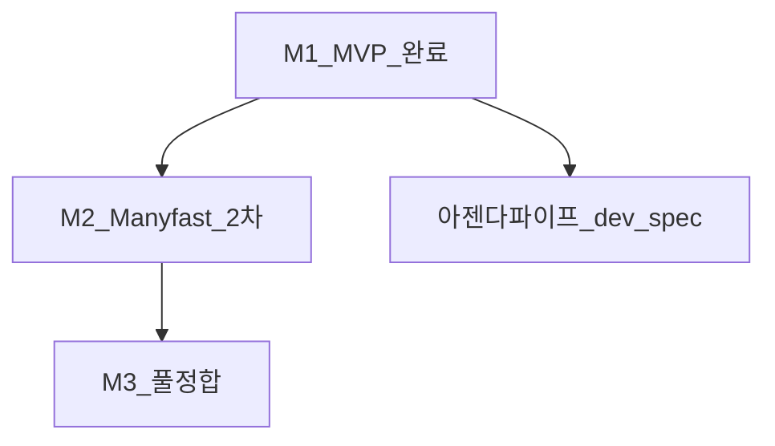

# Plannode AI: Manyfast 정합 + M2/M3 + 하네스 잔류 (v4.1)

> **v4.1** — M1 서술·중복 스택 표는 **[`plannode_dev_spec.md`](/Users/stevenmac/Documents/PSERIES/Plannode/Dev/back/plannode_dev_spec.md)** 로 이관·대체. 본 파일은 **제품 경계(M1/M2/M3)·Manyfast 4.2·뷰/출력 계약·PILOT UX·하네스 NOW 규칙**만 유지한다.  
> 원본 v4 히스토리·M1 완료 표는 git 이전 커밋 참조.

## 문서 구조 (읽는 순서)

| § | 제목 | 역할 |
|---|------|------|
| **0** | **중심 착수 명세** | 아젠다→트리 파이프 — `plannode_dev_spec.md` |
| **1** | 하네스·문서 진실 순위 | TASK · §1.2 규칙 · H1~H4 |
| **2** | 마일스톤 M1/M2/M3 | 범위 경계(한 표) |
| **3** | L5·IA 3종 (완료 요지) | 코드 계약 유지용 요약 |
| **4** | 보기·출력·Manyfast 4.2 | 제품 정본 + M2/M3 열 |
| **5** | M2/M3 요구 ID | §5.0.1 · §5.0.2 |
| **6** | PILOT §7~9 잔류 | IA 이후 UX·갭 |
| **7** | 선택 후행 | Mind Elixir·xlsx |

---

## 0. 중심 착수: 아젠다 → 노드트리

**단일 구현 기준:** [`/Users/stevenmac/Documents/PSERIES/Plannode/Dev/back/plannode_dev_spec.md`](/Users/stevenmac/Documents/PSERIES/Plannode/Dev/back/plannode_dev_spec.md)

- 이미 구현된 스택(`messages` 라우트, `anthropicMessages`, `contextSerializer`, `promptMatrix`, `parsePlannodeTreeV1*`, 배지 파이프, `upsertImported…`, `insertAiGenerationL5`, `pilotBridge`)은 개발서 **§0 표**를 따른다.
- **미구현 갭**(아젠다 UI, JSON 강제 프롬프트, 응답→파싱→스토어→캔버스, 머지 정책)은 개발서 **§1~§8** 파이프라인·파일 목록·구현 순서로만 진행한다.
- **정본 보정:** 파서 반환형(`ParsePlannodeTreeV1Result`), 인증(`getSupabaseUserForRequest`), `fetchAnthropicAssistantText` 인자, `insertAiGenerationL5` 필드명 — [`.cursor/plans/ai_스택·갭_정리_1e8a3f28.plan.md`](ai_스택·갭_정리_1e8a3f28.plan.md) §4.

`callAI` 관행명 = `POST /api/ai/messages` + `fetchAnthropicAssistantText` (하네스·TASK 동일). 아젠다 플로우는 **`POST /api/ai/agenda-to-tree`** (개발서).

---

## 1. 하네스 정합 — 진실 순위 · 잔류 작업

**순위 (합의):** ① `.cursor/harness/TASK.md` — NOW / DONE / GATE LOG · ② 본 §1~§5 · ③ `plan-output.md`(M2 착수 전 갱신 또는 “§1만 참조” 부속).

### 1.1 M1 완료 귀결 (한 줄)

M1 웹 기획툴 MVP(L5 IA 3종·`IAExportMenu`·`treeText`·서버 Anthropic·`ai_generations` 1-stage·nodes↔파일럿·IA 메뉴 배치·F2-4/5 최소·PILOT UX 일부)는 **TASK·GATE D 기준 완료**로 본다. 세부 체크리스트는 TASK·DONE 항목을 본다.

### 1.2 대기·미완·문서–구현 갭 (NOW 후보)

| ID | 내용 | 다음 액션 |
|----|------|-----------|
| **H1** | `plan_nodes.path`(PRD §11) — 전용 완료 SQL·TASK NOW 한 줄 | GP-4 신규 SQL + NOW `PRD: M3 F3-2` 등 |
| **H2** | PILOT §9~§10 수동·@qa 검증 **미기록** | 검증 표 채움 |
| **H3** | `plan-output.md` M1 스냅샷 vs GATE D 불일치 | 아젠다 한 줄 갱신 또는 §1만 참조 명시 |
| **H4** | 본 v4 과거 시제(구현 공백 서술) 리프레시 | 코드 인용만 하는 문서 NOW |
| **M2/M3** | §5.0.1 / §5.0.2 표 ID | GATE B → NOW에 `v4 §5.0.1 <ID>` 필수 |
| **VO** | 뷰·출력 재정립 — §4.0·4.0.1·`view-output-contract-v4` | [뷰·출력_메뉴_재정립_8c32c88d.plan.md](뷰·출력_메뉴_재정립_8c32c88d.plan.md) · GATE B 후 구현 |

### 1.3 이어서 실행 최소 규칙

1. `TASK.md` NOW 한 줄에 **`v4 §5.0.1 <ID>`** 또는 **`H1`~`H4`** 중 하나를 텍스트로 포함.  
2. M2 착수 전 `plan-output.md` 갱신 또는 **§1 + TASK**만 아젠다로 본다.  
3. PRD 절 걸리면 `TASK`에 **`PRD: M#`** 한 줄 추가 후 `@qa`가 `plannode-prd.mdc` 연다.

---

## 2. 마일스톤 (M1 / M2 / M3) — 범위 한 표

| 단계 | 이름 | 목표 (요지) |
|------|------|----------------|
| **M1** | 웹 기획툴 MVP | 노드맵 → IA·MD 산출 실서비스 + PILOT §7~9 신뢰 UX **최소** — **완료 귀결은 §1.1** |
| **M2** | Manyfast 2차 | PRD 동기·xlsx·그리드·캔버스 재연결·검색·L3 골격 등 — **§5.0.1 ID** |
| **M3** | Manyfast 풀 정합 | 업로드 추출·PRD AI 풀·플로 버전·와이어 AI·개발지시서 — **§5.0.2 ID** |

아젠다→초기 트리는 **M1 이후 보강**으로 `plannode_dev_spec`에 정의(신규 라우트·모달).

---

## 3. L5·엑셀형 IA (완료 요지 — 계약 유지)

| `OutputIntent` | 산출 |
|------------------|------|
| `IA_STRUCTURE` | 표 + Mermaid |
| `SCREEN_LIST` | 화면 목록 표·Path·P1~P3 |
| `FUNCTIONAL_SPEC` | 기능 정의서 표 |

구현 루프는 `promptMatrix` → `buildPrompt` / `iaExporter` → `IAExportMenu` → `/api/ai/messages` → 선택적 `insertAiGenerationL5`. **내부 식별자는 유지**; 사용자 라벨은 §4.0.

**2차 “진짜 엑셀”:** `optional-xlsx` · §5.0.1 **M2-EXPORT-XLSX**.

---

## 4. 보기·출력 제품 정본 + Manyfast 4.2

### 4.0 보기(뷰) / 출력 그룹

- **보기:** 코드 `tree` 유지, 사용자 면에서는 **「노드」(캔버스)** 권장. PRD · 기능명세 · IA(정보구조) · AI 분석.  
- **기능명세·IA:** M2에서 편집·저장·xlsx — §5.0.1 `M2-VIEW-SPEC-GRID` / `M2-VIEW-IA-GRID`.  
- **출력:** MD · PRD · JSON · 와이어프레임(§4.0 표). 사용자 노출에서 `IA-구조도` 등 **분할 출력명 제거**는 유지.

### 4.0.1 캔버스: 노드 카드 재연결

3초 선택 → `+` 드롭 · 단일/서브트리 · `parent_id` · 순환 방지 — **M2** `M2-CANVAS-NODE-RELINK` · PILOT §7.

### 4.1 메뉴 위치

기능명세 **다음** IA(정보구조). 출력 그룹에서 **PRD 다음** MD·PRD·JSON·와이어.

### 4.2 Manyfast ↔ Plannode (요약)

| Manyfast 축 | M1 | M2 | M3 |
|-------------|----|----|-----|
| 프로젝트·온보딩 | CRUD·ACL·빈 프로젝트·루트 | 가벼운 질문지 | **업로드→초안** |
| PRD | 뷰·buildPRD 동기 최소 | 파이프·승인 골격 | 인라인·부분/전체 AI 풀 |
| 기능·디렉터리 | 캔버스(노드)·L5 표 | 검색·§4.0.1 | 3계층·풀 디렉터리 |
| 유저 플로 | 간선·SCREEN_LIST·Mermaid | `.mermaid`보내기 | 전용 플로·버전 |
| 와이어 | IA·표로 대체(문서) | — | 와이어 AI |
| 보내기 | MD·복사·Mermaid | xlsx 번들 초안 | xlsx·개발지시서 풀 |

상세 URL·문장은 [Manyfast Plan](https://docs.manyfast.io/plan/plan) 등 기존 v4 참조 링크 유지.

---

## 5. M2 / M3 — NOW에 적을 ID (체크 가능)

### 5.0.1 M2 포함 (권장 ID)

`M2-PRD-SYNC` · `M2-EXPORT-XLSX` · `M2-VIEW-SPEC-GRID` · `M2-VIEW-IA-GRID` · `M2-CANVAS-NODE-RELINK` · `M2-EXPORT-MERMAID` · `M2-DIR-SEARCH` · `M2-L3-PIPE` · `M2-ONBOARD-LITE`

**NOW 규칙:** 위 **ID 1개**(또는 명시적 2개)만 한 줄에. 표 전체 금지(GP-12).

### 5.0.2 M3 포함 (권장 ID)

`M3-ONBOARD-UPLOAD` · `M3-PRD-AI-FULL` · `M3-DIR-FULL` · `M3-FLOW-VERSION` · `M3-WIRE-AI` · `M3-EXPORT-BUNDLE`

### 5.0 M1에 넣지 않은 것 (여전히 제외)

Manyfast **풀** 온보딩·문서 추출·PRD 부분 AI 풀·디렉터리 풀·플로 버전·와이어 AI·개발지시서 베타 → **`manyfast-core-parity`** · M3.

---

## 6. PILOT §7~9 — IA 이후 UX 잔류

- 단일 기준: [`docs/PILOT_FUNCTIONAL_SPEC.md`](../../docs/PILOT_FUNCTIONAL_SPEC.md) §7 부가 뷰·§9 갭·§10 체크리스트.  
- 흔한 갭: PRD/Spec placeholder·줌/간선 transform·첫 노드·미니맵·IA 모달 가독성·**「노드」라벨·§4.0.1 재연결** 문구 정합.  
- 산출: §9 표 채움 + IA UX 한 페이지 트래킹 — **L5 머지 이후** 스프린트 권장.

---

## 7. 선택 후행

- **§8 Mind Elixir** — `optional-mind-elixir`: 읽기 전용 마인드맵·PNG; 캔버스 편집과 역할 분리.  
- **xlsx** — `optional-xlsx` + §5.0.1.

---

## 8. 정리

| 무엇 | 어디서 본다 |
|------|-------------|
| 아젠다→트리 **구현** | **`plannode_dev_spec.md`** |
| 스택·파서·정본 보정 요약 | **`ai_스택·갭_정리_1e8a3f28.plan.md`** |
| M2/M3·Manyfast·뷰/출력 계약 | **본 v4.1 §4~§5** |
| 하네스·NOW·갭 ID | **본 §1** + `TASK.md` |
| PILOT 회귀 | **§6** |

**기술 불변(요지):** L5 전체 IA는 **L3 풀 파이프 비연동·단일 스테이지 호출**; `ai_generations` **1-stage·node_id null**; IA **3인텐트 표 + Mermaid**.

**결합 문서 (역할만):** [plannode_ai_v2_고도화_b084b2b3.plan.md](plannode_ai_v2_고도화_b084b2b3.plan.md) 로드맵 YAML · [plannode-ai-enhancement-v3.md](plannode-ai-enhancement-v3.md) L1~L5 기술 세부.

*v4.1 | 중심: plannode_dev_spec.md | 2026-05*
