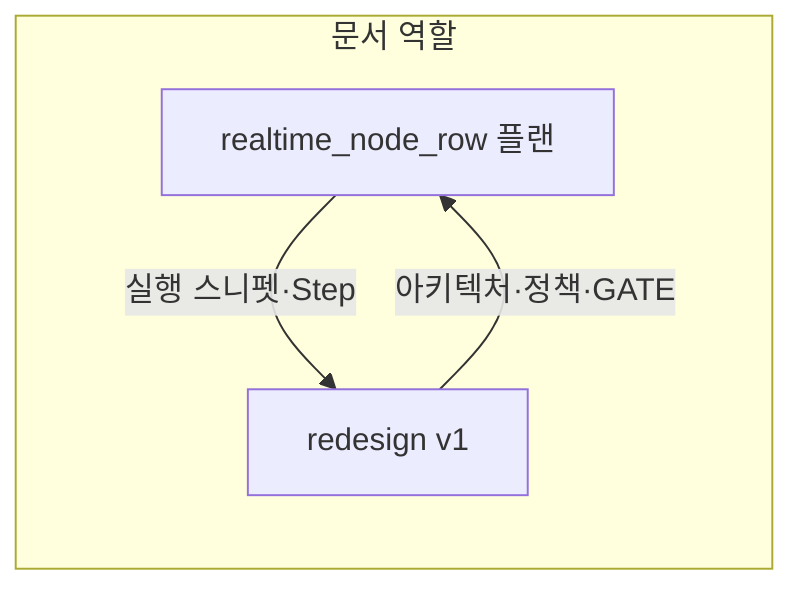

# Realtime 두 플랜 비교 및 `plannode_realtime_sync_redesign_v1.md` 통합 보완안

## 비교 요약

| 구분 | [realtime_node_row_구현_eab9b7de.plan.md](.cursor/plans/realtime_node_row_구현_eab9b7de.plan.md) | [plannode_realtime_sync_redesign_v1.md](.cursor/plans/plannode_realtime_sync_redesign_v1.md) |
|------|----------------------------------|-------------------------------------|
| 목적 | Layer 2 **클라이언트 실구현** (함수·파일·코드 초안) | **아키텍처·정책·단계 전략** (Layer 1~3, Step 0~4) |
| 중복 | 3파일 범위, 채널 `plannode:noderows:…`, echo 1초, 원격 경로 더티 금지, 이중 쓰기 | §0, §2.3.1, §3, §5 Step 2, §6에 이미 **동일 계약** 반영 (v1.2) |
| `redesign`에 **덜 든** 내용 | TASK/소스 **불일치 진단**, **정책 1~9×구현 영향** 표, **`uploadWorkspaceToCloud` 내 이중 쓰기 3곳·`pushProjectSlicesToOwners` 직후** 문구, **`cloudSyncAvailable` 구독 가드**, **postgres_changes 페이로드에서 `project_id`/`node_id`/`data` 추출 규칙**, **Step 1~4 빌드 검증** 순서, Layer 2 전용 **상세 mermaid** | — |

**결론:** `redesign v1`을 “단일 진입 문서”로 쓰려면, [§2.3.1](.cursor/plans/plannode_realtime_sync_redesign_v1.md) 아래에 **실행·검증 부록**을 추가하고, [§0.5.8](.cursor/plans/plannode_realtime_sync_redesign_v1.md) 또는 새 소절에 **정책↔코드 조치** 표를 흡수하는 것이 좋다. 전체 코드 스니펫을 `redesign`에 두 번 넣지 말고, **“전문은 `realtime_node_row` 플랜 유지”** 한 줄을 유지해 중복을 피한다(GP-12).

---

## `plannode_realtime_sync_redesign_v1.md`에 추가할 통합 보완 (권장 위치·요지)

### 1) §2.3.1 직후 — 부록 **「Layer 2 실행 체크리스트 (소스)」**

다음 bullet만 추가하면 `realtime_node_row`의 실행 정보가 빠지지 않는다.

- **진단:** TASK에 완료만 있고 `subscribeToNodeRowChanges` 등이 `src`에 없을 수 있음 — 이행 전 `sync.ts` / `projects.ts` / `+page.svelte` grep으로 공백 확인.
- **이중 쓰기 삽입:** `uploadWorkspaceToCloud` **성공 분기** 안, 기존 **`pushProjectSlicesToOwners` 호출 직후** 등 **동일 성공 경로 3곳**에 소유자 프로젝트만 루프 (`bundle.projects`에서 `owner_user_id === auth user`일 때만 `upsertNodesToNodeRows`).
- **구독:** `+page.svelte`에서 `$currentProject` 반응 시 **`typeof window !== 'undefined'`** 및 **`cloudSyncAvailable`**(또는 동등한 “클라우드 동기 사용 가능” 플래그) 가드 후 `subscribeToNodeRowChanges` / 전환·null 시 `unsubscribeNodeRowChanges`; `onDestroy`에서 반드시 해제(§6 item 4와 정합).
- **페이로드 파싱:** `applyNodeRowChangeFromDb`에서 `project_id`·`node_id`는 `payload` / `payload.old` 등 **이벤트 타입별 분기**로 안전 추출; `INSERT`/`UPDATE`의 노드 본문은 `data` 또는 `new.data` 계열에서 읽기 — 구현 시 Supabase 클라이언트가 넘기는 shape와 맞출 것.
- **코드 참조:** 함수 시그니처·전체 스니펫은 [realtime_node_row_구현_eab9b7de.plan.md](.cursor/plans/realtime_node_row_구현_eab9b7de.plan.md) Step 1~3을 단일 진실로 둔다.

### 2) §2.3.1 또는 §6 — **페이로드·Echo·LWW 한 줄 보강**

`redesign`에 이미 있는 echo 1초·LWW에 더해, `realtime` 플랜의 **“원격 `updated_at` vs 로컬 `getLastLocalNodeUpdateTime`”** 및 **“저장소 기존 노드 `updated_at`과 비교”** 순서를 한 문단으로 명시하면 §1.2 C(타임스탬프)와 실코드가 직결된다.

### 3) §0.5.8 보완 — **「정책 1~9 × Layer 2 구현 조치」** 표 (간략판)

[realtime 플랜 표](.cursor/plans/realtime_node_row_구현_eab9b7de.plan.md) (L36~45)를 그대로 복붙하면 길어지므로, `redesign`에는 **3열**(정책 | Layer 2에서의 조치 | 비고)로 축약해 넣는다. 예: 정책 1 → `data`에 전체 `Node` 직렬화; 6 → `recordLocalNodeUpdateTime` + echo; 7~8 → DELETE 시 로컬 purge; 9 → `nodes.set`만, 파일럿 직접 DOM 패치 금지.

### 4) §5 Step 2 행 보완 — **하위 실행 순서**

Step 2표 아래에 한 줄: **실행 순서 = `projects.ts` 타임스탬프 → `sync.ts` 구독·적용·이중 쓰기 → `+page.svelte` 생명주기 → `npm run build`.**

### 5) §2 다이어그램 — **Layer 2 상세 흐름 (선택)**

[realtime 플랜 L283~317 mermaid](.cursor/plans/realtime_node_row_구현_eab9b7de.plan.md)는 §2.5 3계층 도와 **역할이 다름**. `redesign` §2.3.2 **「Layer 2 데이터 흐름 (번들·node_rows·Realtime)」** 으로 해당 다이어그램을 붙이면 “확정본” 경로 이해가 빨라진다.

### 6) §7 리스크 — **한 줄**

`upsertNodesToNodeRows`가 노드별 순차 `await`일 경우 대형 프로젝트에서 업로드 지연 가능 → 추후 배치 upsert / Edge(Step 3)와 트레이드오프.

### 7) 문서 히스토리

**v1.3 (날짜):** `realtime_node_row` 플랜의 실행 체크리스트·이중 쓰기 3곳·구독 가드·페이로드 파싱·진단·Step 순서·(선택) Layer 2 mermaid를 §2.3 부록·§0.5.8·§5·§7에 통합.

---

## 적용 시 주의

- **단일 수정 파일 3개** 원칙(`sync.ts`, `projects.ts`, `+page.svelte`)은 두 문서가 동일; `redesign` 보완은 **문서만** 변경.
- §2.3 의사코드 채널이 `plannode:project:${projectId}` 로 적혀 있으면 §2.3.1 **전용 채널** 문구와 시각적 충돌이 난다. 보완 시 §2.3 블록에 **“실제 채널명은 §2.3.1 준수”** 각주 한 줄을 넣는 것을 권장한다.

