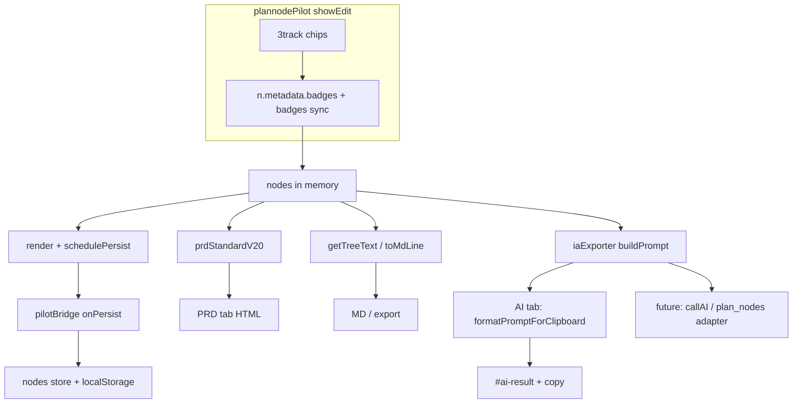

# 배지 3트랙 · 노드 고도화 — 파이프라인 구현정보

> **문서 목적**: [배지_3트랙·ai_연동_104e094d.plan.md](file:///Users/stevenmac/.cursor/plans/배지_3트랙·ai_연동_104e094d.plan.md)(이하 **원 플랜**)에 대응하여, **현재 코드베이스에 반영된 데이터·프롬프트·UI·동기화 흐름**을 한곳에 정리한다.  
> **범위**: 런타임·로컬 스토어·문자열 조립까지. **범위 밖**은 §8·§9로 분리.  
> **기준일**: 2026-04-25 (KST) — 후속 변경 시 본문 갱신 권장.

---

## 1. 메타

| 항목 | 값 |
|------|-----|
| 원 플랜 | `~/.cursor/plans/배지_3트랙·ai_연동_104e094d.plan.md` (overview: BadgeSet + 인젝터 + PRD/트리 + 파일럿 3트랙; `plan_nodes`·실 `callAI`는 후속) |
| 본 문서 위치 | 저장소 루트 기준 [`.cursor/plans/배지_3트랙_노드고도화_파이프라인_구현정보.md`](배지_3트랙_노드고도화_파이프라인_구현정보.md) |
| 하네스·범위 참고 | [`.cursor/harness/NEXT7_SCOPE.md`](../harness/NEXT7_SCOPE.md) — **후속(callAI·DB)** 는 거기서 GATE·범위 중심으로 기술 |

---

## 2. 요약: 원 플랜 대비 구현 상태

| 구분 | 내용 |
|------|------|
| **구현됨** | `src/lib/ai/` (`types`, `badgePromptInjector`, `promptMatrix`, `iaExporter`), `Node.metadata`, 파일럿 3트랙 모달·칩, `prdStandardV20` 트리/표/노드 블록·배지 문맥, `plannodeTreeV1`·`pilotBridge`·`projects`의 `metadata` I/O, Vitest `badgePromptInjector.test.ts`, AI 탭 `buildPrompt` + 클립보드·`#ai-result` |
| **의도적 비구현 (원 플랜 §7)** | Supabase `plan_nodes` 스키마·RLS, **서버/Edge `callAI`**, v3 문서 수준의 **전부** `PROMPT_MATRIX`·4레이어 파이프라인 |
| **스텁** | [`iaExporter.ts`](../../src/lib/ai/iaExporter.ts) `generateDocumentFromPrompt` — API 키 없이 실 LLM 호출 없음 |

---

## 3. 데이터 모델 (단일 읽기·쓰기 흐름)

### 3.1 캐논

- **타입**: [`src/lib/ai/types.ts`](../../src/lib/ai/types.ts) — `BadgeSet { dev, ux, prj }`, `NodeMetadata` (`badges?`), `OutputIntent`.
- **런타임 `Node`**: [`src/lib/supabase/client.ts`](../../src/lib/supabase/client.ts) — `metadata?: NodeMetadata` (또는 동등 필드).

### 3.2 읽기 (레거시 호환)

- **단일 입구**: `getBadgeSetFromNodeInput(node)` in [`badgePromptInjector.ts`](../../src/lib/ai/badgePromptInjector.ts) — `metadata.badges`가 있으면 사용, 없으면 `badges: string[]` → `migrateLegacyBadgesToSet()`.
- 키·표시: 조각/프롬프트 쪽은 **대문자** 통일(레거시 소문자는 마이그레이션에서 상향).

### 3.3 쓰기 (파일럿)

- **UI**: `showEdit`에서 3트랙 칩 → `applyBadgeSetToNode(n, set)` — `n.metadata.badges` 갱신 후 `badges` 평면 배열 동기화(`flattenBadgeSet`).
- **지속**: `onPersist` → [`pilotBridge.ts`](../../src/lib/pilot/pilotBridge.ts) `pilotNodesToStore` → `persistNodesFromPilot` (localStorage + Svelte `nodes`).

---

## 4. 모듈·파일 역할 (지도)

| 경로 | 역할 (요지) |
|------|-------------|
| [`src/lib/ai/types.ts`](../../src/lib/ai/types.ts) | `BadgeSet`, `NodeMetadata`, `OutputIntent` (`PRD` \| `WIREFRAME_SPEC` \| `SCREEN_LIST` \| `FUNCTIONAL_SPEC` \| `IA_STRUCTURE`) |
| [`src/lib/ai/badgePromptInjector.ts`](../../src/lib/ai/badgePromptInjector.ts) | `BADGE_PROMPT_FRAGMENTS`, `buildBadgeContext`, `getBadgeSetFromNodeInput`, `formatBadgeTracksForDisplay`, `migrateLegacyBadgesToSet`, `flattenBadgeSet`, `shouldForceSonnet` (**정의만·모델 라우터 미연결**) |
| [`src/lib/ai/promptMatrix.ts`](../../src/lib/ai/promptMatrix.ts) | `PROMPT_MATRIX` (최소 **root** × 위 `OutputIntent`들), `getSystemPrompt(nodeType, outputIntent)` — 비어 있으면 `root`·`PRD` 폴백 |
| [`src/lib/ai/iaExporter.ts`](../../src/lib/ai/iaExporter.ts) | `nodesToTreeText` (노드별 `《…》` 트랙), `buildPrompt(nodes, project, outputIntent, nodeType)` — 시그니처 기본 `outputIntent`는 `'WIREFRAME_SPEC'`, `nodeType`는 `'root'`(파일럿 `triggerAI`는 **항상** `outputIntent`·`'root'`를 넘김), 트리 + **전 노드 병합** `BadgeSet` → `buildBadgeContext` + user 본문, `formatPromptForClipboard`, `exportDocument`, `generateDocumentFromPrompt` **스텁** |
| [`src/lib/prdStandardV20.ts`](../../src/lib/prdStandardV20.ts) | PRD 뷰: 트리 줄·요약 표·노드 블록에 `getBadgeSetFromNodeInput` / `formatBadgeTracksForDisplay` / (조건부) `buildBadgeContext` |
| [`src/lib/plannodeTreeV1.ts`](../../src/lib/plannodeTreeV1.ts) | plannode.tree v1 import/export에 `metadata` optional |
| [`src/lib/pilot/pilotBridge.ts`](../../src/lib/pilot/pilotBridge.ts) | `pilotNodeContentChanged`에 `metadata` 포함, `pilotNodesToStore` / `storeNodesToPilot` |
| [`src/lib/stores/projects.ts`](../../src/lib/stores/projects.ts) | 루트 시드 등 `metadata: {}` 기본값 |
| [`src/lib/pilot/plannodePilot.js`](../../src/lib/pilot/plannodePilot.js) | 3트랙 모달, `toMdLine`/`getTreeText` 3트랙, `triggerAI` + `formatPromptForClipboard`(`buildPrompt`) |

---

## 5. 파이프라인 (데이터 흐름)

- **Per-node** 트랙 요약: 트리 MD 줄·`nodesToTreeText` — `formatBadgeTracksForDisplay(getBadgeSetFromNodeInput(node))`.
- **User 프롬프트 하단** `buildBadgeContext`: `buildPrompt` 안에서 **모든 노드** 배지를 합친 `BadgeSet`에 대해 **한 번** 생성(전역 제약·조각 합성).

---

## 6. AI 탭 · `OutputIntent` 정합

- **호출**: [`plannodePilot.js`](../../src/lib/pilot/plannodePilot.js) `triggerAI(type)`  
  - `const outputIntent = AI_INTENT_BY_TYPE[type] || 'PRD'`
  - `buildPrompt(nodes, { name, description }, outputIntent, 'root')`  
  - `getSystemPrompt('root', outputIntent)` — `PROMPT_MATRIX.root[outputIntent]`

| `type` (버튼 키) | `outputIntent` |
|------------------|----------------|
| `prd` | `PRD` |
| `wireframe` | `WIREFRAME_SPEC` |
| `miss` | `SCREEN_LIST` |
| `tdd` | `FUNCTIONAL_SPEC` |
| `harness` | `IA_STRUCTURE` |

- **`WIREFRAME_SPEC`**: `promptMatrix`의 `PROMPT_MATRIX.root.WIREFRAME_SPEC` — AI 탭 `id="ai-wireframe"`·`type` `wireframe`으로 `buildPrompt`·`#ai-result`에 노출(플랜 §3-1 `OutputIntent` 정합).

---

## 7. 테스트·빌드

| 항목 | 명령 / 위치 |
|------|-------------|
| 단위 | `npm test` — [`src/lib/ai/badgePromptInjector.test.ts`](../../src/lib/ai/badgePromptInjector.test.ts) (`buildBadgeContext` 등) |
| 통합 | `npm run build` — SvelteKit 프로덕션 빌드 |

---

## 8. 하네스·후속 (요지)

- [`TASK.md`](../harness/TASK.md): NEXT-7(선택) — 서버 `callAI`·`plan_nodes`·RLS 는 **별도 범위·GATE B**.
- [`NEXT7_SCOPE.md`](../harness/NEXT7_SCOPE.md): A+B 통합 범위 문·제외(전체 `PROMPT_MATRIX`·비로그인 API 등).

**역할 구분**: 하네스 문서 = **승인·GATE·후속 Phase**; **본 문서** = **지금 돌아가는 코드 경로** 위주.

---

## 9. 보완 시 체크리스트

- **`callAI` 연동**: API 키는 서버 env만, 클라이언트 번들 금지; `iaExporter` 스텁을 실 HTTP로 교체; CORS·에러·키 미설정 시 클립보드 폴백 유지 권장.
- **`plan_nodes`**: `metadata`(또는 `meta`) JSONB·RLS; 읽기 어댑터는 `getBadgeSetFromNodeInput`과 동일 계약 맞출 것.
- **`WIREFRAME_SPEC` UI**: `plannodePilot` `AI_INTENT_BY_TYPE` + `+page.svelte` AI 버튼 id/바인딩 일치.
- **`shouldForceSonnet`**: 모델 라우터 도입 시에만 유효; 미사용이어도 단위는 유지 가능.

---

*원 플랜 본문은 수정하지 않으며, 구현과의 차이는 본 문서·하네스를 우선으로 한다.*
