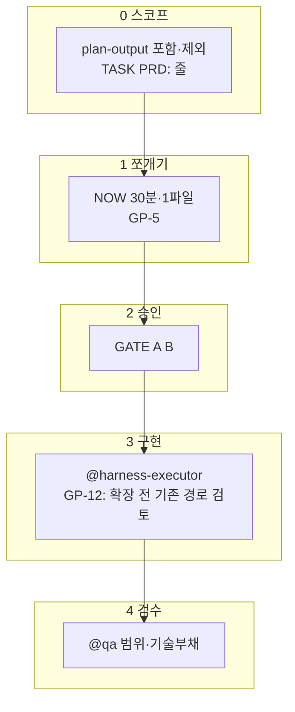
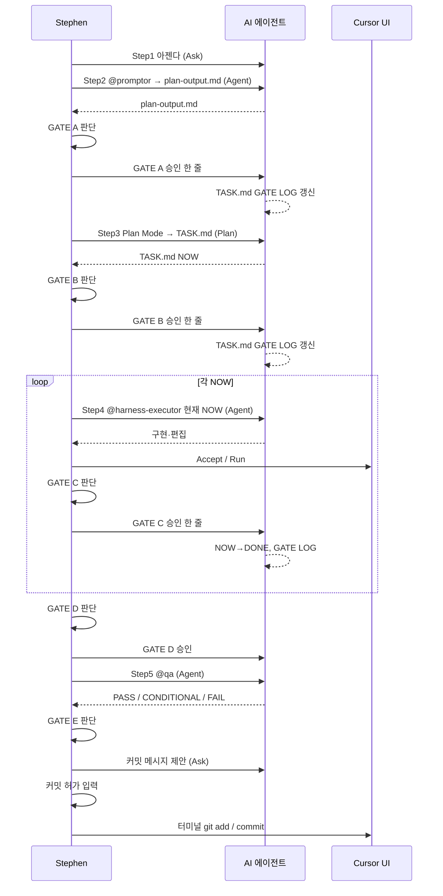
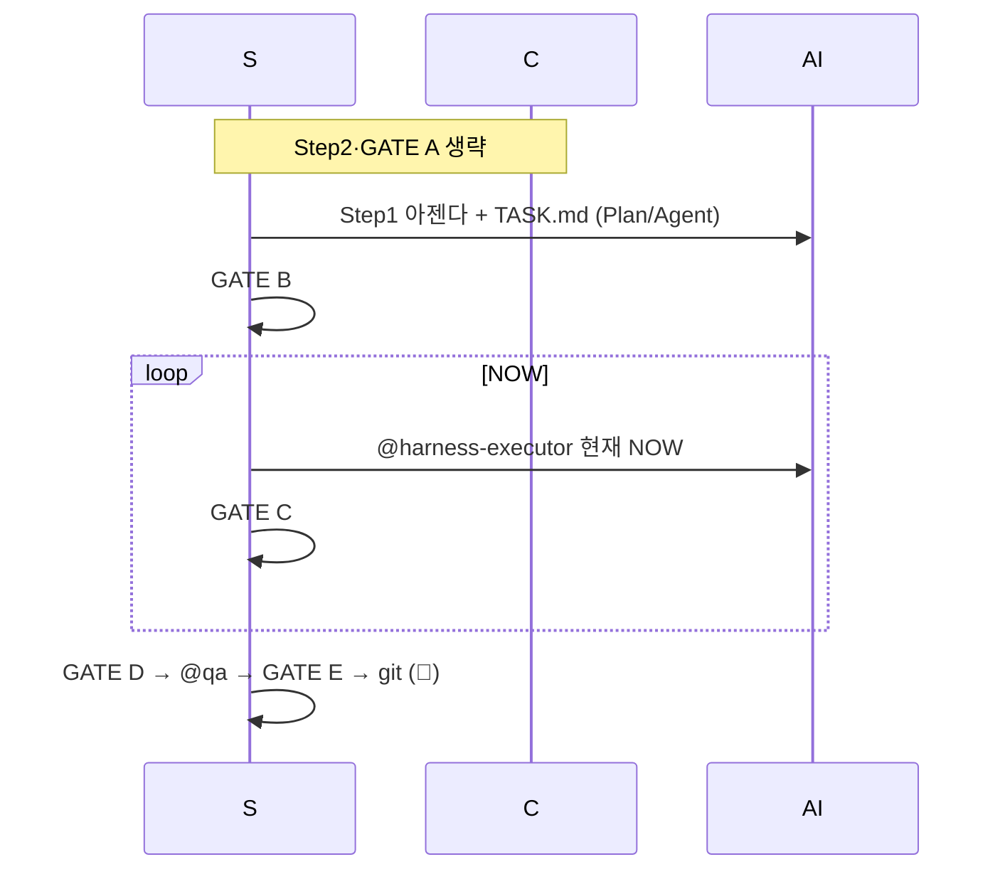

# Plannode 하네스 워크플로우 — 최종 가이드라인

> **Mermaid**: Cursor에서 `Markdown Preview Mermaid Support` 익스텐션 사용 시 다이어그램이 렌더됩니다(미리보기 `Ctrl+Shift+V`).

> **이 문서는** 1teamworks `harness-workflow_final.md`와 **동일한 뼈대(모드·GATE·복붙 규율)** 를 따르며, Plannode 저장소(`AGENTS.md`, `.cursor/harness/`, `.cursor/agents/harness-executor.md`) **실제 에이전트명**에 맞춰 둡니다. 타 프로젝트의 `@gsd-agent`에 해당하는 Step4는 Plannode에서는 **`@harness-executor`** 입니다.

## 문서 지위·외부 검토와의 관계

| 구분 | 내용 |
|------|------|
| **본 파일** | Cursor **실사용 복붙**·GATE 순서·Plannode 단일 기준(커밋 대상). |
| **`HARNESS_WORKFLOW_20ROUND_IMPROVEMENT_REVIEW.md`** | 동일 리포지토리 상위 `back/` 등에 두는 **20회차 개선 검토 보고서**(증거 ZIP·엔진 흡수·수치 자동 판별 등 **장기안**). |
| **이번에 통합한 것** | 검토서 §4~§5 중 **코딩 없이** 지킬 수 있는 항목 — **고위험 모드**, **점수 보조 판별**, **GATE 계약표**, **DIFF·증거 최소**, **QA FAIL 분류·단축 탈출**, **비밀·롤백·드리프트·UI 스모크** 한 줄 규율. |
| **통합하지 않은 것** | `evidence_upload.zip` 필수화·엔진 자동 PASS 등 — **별도 엔진/자동화** 도입 시 검토서 **§4**·작업명세 **§7** 참고. |

---


## Plannode 전용 한 줄 요약

| 항목 | Plannode |
|------|----------|
| **제품·범위** | `.cursor/rules/plannode-prd.mdc` (M#·F#-#, IA≠AI, §10·§11) |
| **파일럿 정합** | `docs/PILOT_FUNCTIONAL_SPEC.md` §9~§10 |
| **Step2** | `@promptor` → `.cursor/harness/plan-output.md` |
| **Step3** | Plan Mode → `.cursor/harness/TASK.md` (NOW 30분 단위) |
| **Step4** | `@harness-executor` (GSD / GSD+)** — 결제·동시성 TDD는 본 PRD가 아닌 **일반 경로** |
| **Step5** | `@qa` — `.cursor/agents/qa.md` 단일 출처 |
| **git** | 👤 Stephen만 `git add` / `commit` / `push` |
| **최소·부채** | `AGENTS.md` GP-12, `@promptor` P-6.5, `@qa` 2단계 — **오버 엔지니어링·기술부채** 지양 |
| **단축 제어** | 아래 **「단축화 제어」** — **불필요 로직·모듈 증가**를 GATE·스코프·검수로 견제 |
| **요구범위 밖 수정 금지** | **아젠다·`plan-output`·`TASK` NOW·PRD M#/F#에 근거 없는** 코드·로직 추가·리팩터·파일 생성 **금지** — `AGENTS.md` **GP-7**; 구현 복붙 **「범위 밖 구현 금지」**; 위반 시 `@qa` **범위 초과**·GATE C 재작업. |

---

### 요구범위 이외 코드·로직 (한 줄)

**요구된 스코프 밖** 파일·함수·분기·추상화를 **손대지 않는다**(리팩터·“깔끔하게” 포함). 필요하면 **BACKLOG 또는 다음 아젠다**로 옮긴다.

---

## 단축화 제어 — 오버 엔지니어링 견제·모듈 증가 방지

> **목표:** Plannode는 1인·내부 툴이다. **최대한 단축**을 **기본**으로 하고, “깔끔하게 보이는” **추가 추상·파일**을 **PRD·TASK·GATE 없이** 쌓지 않는다.

### 제어 흐름(요지)



### 규칙(필기용)

1. **스코프** — `포함`에 **없는** 기능·`제외`에 쓴 Phase 밖 v2/LLM·**빈 인터페이스**·“나중” 모듈은 **이번 PR에 없음**.
2. **모듈/파일** — 새 디렉터리·`lib/foo/BarBazHelper.ts`는 **TASK NOW에 근거 한 줄** 없으면 **쓰지 않음**; **기존 파일 1곳**으로 해결 **우선**.
3. **로직** — “재사용 대비” 3중 분기·플러그인 스타일·**YAGNI** 위반 **추가**는 GATE C·@qa에서 **범위 초과**로 표시.
4. **의존성** — `package.json` 변경은 `TASK`·(필요 시) **GATE B 재승인**; 하네스만으로는 **최소 패키지** 권장.
5. **오버엔지니어링 차단 (검토서 §4.7과 동일 취지)** — TASK NOW에 없는 **신규 모듈·폴더** 금지, “나중용” 빈 인터페이스 금지, **한 파일 수정으로 되는 일**에 새 계층 금지, 단축에서 **대형 리팩터·플러그인 구조** 금지.

> 상세 원문: `AGENTS.md` **「단축화·오버엔지니어링 견제 제어 구조」** 표, `.cursor/harness/README.md` **최소 구현·단축화** 절.

---

## 외부 ‘harness’·오버엔지니어링 문헌과 Plannode 하네스 정합

> 아래는 **웹·업계**에서 권하는 *하네스 엔지니어링*·*오버엔지니어링* 방지를 Plannode 맥락에 맞게 **흡수**한 것이다(출처는 참고용).

| 권고·패턴 (요지) | Plannode에서의 **대응(이미 있거나 강화할 것)** |
|------------------|----------------------------------------|
| **Guides(사전) vs Sensors(사후)** [Martin Fowler *Harness engineering*](https://martinfowler.com/articles/harness-engineering.html) | **Guides:** `AGENTS`·`plan-output`·`plannode-prd`·`@promptor` = 행동 **유도**. **Sensors:** `npm run build`·`@qa` 1~2단·린트 = **검출·자기교정**. (Hooks는 Cursor/로컬 CI에 맡기고, **규율**은 GP·GATE·TASK로 고정) |
| **“오버엔지니어링·불필요 기능”**은 센서만으론 **끝까지** 못 잡을 수 있음 (동일 출처) | Plannode는 **0층 스코프(PR)·포함/제외·GATE A/B** + `@qa` **“범위 초과(오버엔지니어링 의심)”**로 **의도(스펙) 선제**—테스트/빌드 **만으로는 부족**하다는 전제. |
| **AGENTS = 목차·~100행**, 상세는 progressive disclosure [OpenAI *Harness engineering* 요지](https://www.engineering.fyi/article/harness-engineering-leveraging-codex-in-an-agent-first-world) | `AGENTS`는 **요약+표**; 세부는 `plannode-prd`·`PLANNODE_INTEGRATED_GUIDE`·`.cursor/harness/`. **한 파일 백과** 확장을 피한다. |
| **층·툴을 늘일수록 실패** — “*Fewer layers, not more*” [Matthew Kruczek](https://matthewkruczek.ai/blog/agent-harnesses-fewer-layers) | **서브에이전트 3개·GATE 5개**는 고정; **가짜**로 또 문서/체크/래퍼를 쌓지 말고, **같은 관문 강화**(테이블·GATE C 문항)가 우선. `GP-12`·`TASK`에 **“새 층/모듈 정당성”** 없으면 **추가하지 않음**. |
| **YAGNI = 요구(명시) 밖**은 쌓지 않는다 [Martin Fowler *YAGNI*](https://martinfowler.com/bliki/Yagni.html) | `plan-output`·`@promptor` P-6.5에 **YAGNI 점검**; `포함/제외`·`PRD M#`에 **없는** 추정 기능·“나중” 추상 = **이번엔 없음**. |
| **GATE = 막힘(차단) 질문** — XP *gates*·YAGNI 정신 [en-yao/xp-gates 요지](https://github.com/en-yao/xp-gates) | `GATE A` “제외/PRD와 모순 없나”, `GATE C` “범위·단축(신규 모듈) 괜찮나” = **순차**로 실패 시 다음 단계 **진행 안 함**과 같음(사람이 판). |
| **가역 vs 비가역** — 짧은 **승인**만 (비가역) [같은 *Fewer layers*·HITL 일반론] | **비가역·고위험** = `git`·`DB`·`push` = **GP-1** 👤, 스키마 = `README` SQL 절. **가역** = 코드 `Accept` = 세션. |
| **C.A.R. / Guides + Sensors** [harn.app 요지](https://harn.app) | Plannode: **Control** = `AGENTS`+GATE+PRD, **Agency** = 3에이전트+Cursor, **Runtime** = `TASK`+`GSD_LOG`+`@qa`. **훅으로만** 늘릴 유혹** 금지**·우선 **문·표로 고정**. |
| **삭제 설계** (모델 개선 → 하네스 **단순**화) [Kruczek] | `GP-12` 후속: 임시 규율(보상 문장) **대신** 구조·이름·린트를 고치고 **짧은** `AGENTS`만 유지—**누적** 문장·규칙 층 쌓기 **경계**. |

### Plannode에서 **추가·강화**한 점(이 섹션 반영)

- **Fowler 한계(스펙 불명확 시 센서 한계)** → **0층: PRD·plan-output `포함/제외`·GATE A** 를 **최우선**으로 못 박기.
- **“층 줄이기” (Kruczek)** → `GP-12`·GATE C **(단축) 문항**·`promptor` YAGNI 한 줄 = **툴을 늘리지 않고** **질문으로** 측정.
- **YAGNI·Simple design** (XP) → P-6.5 + **단축화** 규칙 1~3번과 **동어**.

---

## ⚠️ 1teamworks·공통에서 가져온 운영 원칙(요지)

| # | 원칙 |
|---|------|
| 1 | **GATE는 인간 판정** — 행에 AI 모델명을 “승인 조건”으로 박아 두지 않는다(세션 모델은 별도). |
| 2 | **GATE 기록은 🤖** — `TASK.md` **GATE LOG**는 AI가 갱신, Stephen이 직접 채우지 않는다(프로젝트 규칙과 동일). |
| 3 | **단축모드(※)** — 1teamworks **단축모드**와 같다: `@promptor`·GATE A 생략. `TASK.md` 상단에 `단축 경로: step2·GATE A 생략` 한 줄. |
| 4 | **GATE B·C·D만으로 커밋 자동 불가** — 반드시 채팅에 **「커밋 허가」** 등 최종 승인 후 터미널에서 커밋. |
| 5 | **GATE D ↔ Step5** — D는 “다음 단계 확정”; QA 루브릭·판정은 **`.cursor/agents/qa.md`** 가 단일 출처. |

---

## ① 모드 판별 (아젠다 작성 직후)

> 아래 **하나라도 해당** → **기본모드** (단축 불가)

| 판별 신호 | Plannode 예시 |
|-----------|----------------|
| DB · 스키마 · RLS | `plan_*` 테이블, 마이그레이션, PRD **§11** v2·path·`ai_generations` |
| 광범위·연쇄 | 4개 이상 파일, SvelteKit **스토어·캔버스 파이프라인** 동시 변경 |
| PRD v2 / LLM·4-레이어 | §10 LAYER1~, F2-5, `ContextSerializer` 도입, 모델 선택·파이프라인 |
| F2-4(IA/와이어) **신규 뷰·내보내기** 본격 | 트리→IA.md / 와이어 키트 **새 뷰** |
| 파일럿 갭 **다중** (§9) | 동시에 여러 갭 항목 수정 |

> **전부 해당 없음** + 단일목적·소수파일·경미한 변경 → **단축모드** 후보

```mermaid
flowchart TD
    A([아젠다 작성 완료]) --> B{DB·광범위·PRD v2·F2-4/F2-5\n다중갭?}
    B -->|YES| C([기본모드\n@promptor 포함])
    B -->|NO| D{단일목적·소수파일\n경미한 변경?}
    D -->|YES| E([단축모드\n@promptor 생략])
    D -->|NO| C
```

### 고위험 모드 (검토서 §4.2·4.3 정합)

아래 **하나라도 해당**하면 **단축 불가**이며, **기본모드**만으로 부족할 수 있음 → **기본모드 + 아래 체크**를 GATE·TASK·`@qa`에 명시한다.

| 신호 | 처리 |
|------|------|
| **DB·스키마·RLS·RPC·JWT·ACL** 실질 변경 | `docs/supabase/*.sql`·RLS·`project_acl` 등 — **고위험** |
| **인증·세션·운영 데이터** 영향 | 고위험 — 회귀·권한 매트릭스(역할별 접근)를 `@qa`·TASK에 한 줄 |
| **결제·청구**(해당 시 제품) | 검토서 **고위험모드**와 동일 취급 |

### 모드 판별 보조 (점수·선택 — 검토서 §4.3 축약)

> 사람 판단이 우선. 애매할 때만 **합산**해 본다. **7점 이상** 또는 **DB/권한/인증 행**이면 **고위험·기본 이상** 고정.

| 신호 | 점수 |
|------|-----:|
| 변경 파일 1~2개 | 1 |
| 변경 파일 3~5개 | 2 |
| 변경 파일 6개 이상 | 3 |
| DB·RLS·권한·인증 영향 | **5** |
| 새 npm 의존성 | 3 |
| QA 실패 **2회** 이상(동일 NOW) | 3 |
| QA 실패 **3회** | **5** → **GATE B 소급** (§⑧) |

**판정 참고:** 합계 **0~2** → 단축 후보 / **3~6** → 기본 권장 / **7+ 또는 DB·권한 행** → 고위험·단축 금지.

---

## GATE A~E — 입력·차단·실패 시 (검토서 §4.6 Plannode판)

| GATE | 사람이 막는 것(차단) | 주 입력 | 실패 시 다음 |
|------|---------------------|---------|----------------|
| **A** | 잘못된 스코프로 TASK까지 가는 것 | `plan-output`(포함·제외·PRD §) | plan-output 수정·`@promptor` 재실행 또는 아젠다 재작성 |
| **B** | 너무 크거나 순서 틀린 NOW | `TASK` NOW 목록 | TASK 재분해(Plan)·NOW 쪼개기 |
| **C** | 범위 초과·오버엔지니어링·회귀 미확인 구현 | 완료된 NOW·DIFF 감각 | **동일 NOW** 재구현·§⑧ FAIL |
| **D** | 증거 없이 QA로 보내는 것 | 변경 파일 경로·(선택) 스모크 결과 | 변경 목록 보강·재실행 후 D 재요청 |
| **E** | QA 미통과·민감정보 포함 커밋 | PASS/CONDITIONAL·커밋 문구 | 커밋 보류·NOW 재작업 또는 BACKLOG |

---

## 증거·기준선·DIFF — Plannode **최소 실무** (검토서 §4.4·4.5 중 선택 채택)

> 전체 **evidence ZIP**은 엔진 도입 시 검토서 §4.4를 따른다. **지금**은 아래만 맞춘다.

| 항목 | 최소 규칙 |
|------|-----------|
| **기준선** | NOW 시작 전 선택: 터미널 `git rev-parse HEAD` 한 줄을 **채팅 또는 `GSD_LOG`**에 남기거나, 브랜치명 + “작업 전 스냅샷” 한 줄. |
| **DIFF** | `@harness-executor` 종료 시 **변경 파일 목록** + `GSD_LOG` 한 줄(검토서 §18 필드 중 핵심만). |
| **QA 산출** | `.cursor/harness/QA_REPORT.md`(로컬·gitignore) 또는 `@qa` 리포트에 **PASS/FAIL·변경 파일** 명시. |
| **고위험** | SQL·RLS 변경 시 **실행한 스크립트 파일명** + **👤가 실행**했다는 전제를 TASK/GATE에 한 줄. |

---

## ② 기본모드 (통상 경로)

### 전체 흐름



### 「모델」 열·Ask 행의 읽는 법 (1teamworks와 동일)

- **채팅 모드 Ask** + **이 행 전용 모델: —** → 승인 문장 **한 턴**이면 되고, **상단에서 선택한 세션 모델**이 응답·GATE LOG 갱신을 수행한다.
- **GATE ≠ 특정 제품 모델 고정**; STEP2·4·5 **Agent** 실행 시에만 에이전트·Cursor 설정이 우선.

### 복붙 문장 — **G / R / W** (필독)

| 유형 | 뜻 |
|------|-----|
| **G** | **그대로** 복붙(맞춤법·따옴표·경로까지 문장에 포함된 그대로). |
| **R** | **`[대괄호]` 안만** 실제 값으로 치환, 나머지 G. |
| **W** | `…`·빈 줄·본인 한글만 — 고정 꼬리는 G. |

- **Step3(Plan Mode)** — Plan UI에는 **백틱 안 지시문만** 붙여넣기(필요 시 `Plan Mode:` 는 취향).

### 기본모드 단계별 실행표

| # | 유형 | 단계 | 채팅 모드 | 이 행 전용 모델 | 주체 | 복붙 문장 |
|---|------|------|-----------|------------------|------|-----------|
| 1 | W | **Step1 — 아젠다** | Ask | — | 👤 | [§복붙 Step1](#hp-copy-s1) |
| 2 | G | **Step2 — @promptor** | Agent | (에이전트 설정) | 🤖 | [§복붙 Step2](#hp-copy-s2) |
| 3 | G/W | **GATE A** | Ask | — | 👤/🤖 | [§복붙 GATE A](#hp-copy-ga) |
| 4 | G | **Step3 — Plan Mode** | **Plan** | (Plan UI) | 🤖 | [§복붙 Plan](#hp-copy-s3plan) |
| 5 | G/W | **GATE B** | Ask | — | 👤/🤖 | [§복붙 GATE B](#hp-copy-gb) |
| 6 | G | **Step4 — @harness-executor** | Agent | (에이전트 설정) | 🤖 | [§복붙 executor](#hp-copy-ex) |
| 7 | G | **GATE C** (NOW마다) | Ask | — | 👤/🤖 | [§복붙 GATE C](#hp-copy-gc) |
| 8 | G | **GATE D** | Ask | — | 👤/🤖 | [§복붙 GATE D](#hp-copy-gd) |
| 9 | R | **Step5 — @qa** | Agent | (에이전트 설정) | 🤖 | [§복붙 @qa](#hp-copy-qa) |
| 10 | G | **GATE E + 커밋** | Ask | — | 👤/🤖 | [§복붙 GATE E](#hp-copy-ge) |

> **GATE D ↔ @qa** — D 승인 후 **즉시 Step5**; 도메인·PRD·파일럿갭·판정 포맷은 **qa.md**만 본다.

### 기본모드 - 복붙 블록 (전문·채팅에 그대로)

<a id="hp-copy-s1"></a>
**Step1 — 아젠다 (Ask · W)**

```text
목표:
(한 줄)

범위 밖:
(한 줄 또는 없음)

PRD: M# F#-# 또는 § (해당 없으면 "없음")

참고:
(파일·이전 스레드 요약)
```

<a id="hp-copy-s2"></a>
**Step2 — @promptor (Agent · G)**

```text
@promptor 아래 아젠다만 보고 `@plan-output.md`에 저장해줘. PRD는 plannode-prd.mdc와 § 단위로 연계. 코드·git 커밋 금지.

--- 아젠다 ---
(Step1 전체 붙여넣기)
--- 끝 ---
```

<a id="hp-copy-ga"></a>
**>>GATE A — 승인 (Ask · G)**

```text
GATE A 승인. Step3 진행. / (Plan Mode)
```

**>>GATE A — 수정 요청 / (Ask · W)**

```text
GATE A 수정: plan-output에서 다음을 반영해줘 — (구체 요약)
```

**>>GATE A — 반려·처음부터 / (Ask · W)**

```text
GATE A 반려. Step1 아젠다부터 다시. 이유: (한 줄)
```

<a id="hp-copy-s3plan"></a>
**Step3 — Plan → TASK / (Plan · G)**

```text
(GATE A 확정) @plan-output.md 입력 @TASK.md NOW/DONE 형태로. 태스크 30분 단위. PRD: 줄 유지.
```

<a id="hp-copy-gb"></a>
**>>GATE B — 승인** / (Ask · G)

```text
GATE B 승인. @harness-executor 로 현재 NOW만.
```

**>>GATE B — TASK 수동 수정 후 / (Ask · G)**

```text
GATE B: TASK.md 는 내가 수정했어. NOW 순서만 검토해줘. @harness-executor 는 아직 호출하지 마.
```

**>>GATE B — 반려·TASK 재작성 / (Ask · W)**

```text
GATE B 반려. Plan 모드로 TASK부터 다시. 이유: (한 줄)
```

<a id="hp-copy-ex"></a>
**Step4 — @harness-executor**  — GATE B **다음 턴** / (Agent · G)

```text
@harness-executor . @TASK.md 현재 NOW만. 범위 밖 구현 금지. 끝나면 TASK·GSD_LOG·한 줄 요약. — @harness-executor.md
```

<a id="hp-copy-gc"></a>
**>>GATE C** / (Ask · G)

```text
GATE C 승인. 다음 NOW.
```

```text
GATE C 승인. 전부 끝. GATE D로.
```

<a id="hp-copy-gd"></a>
**>>GATE D** / (Ask · G)

```text
GATE D 승인. @qa 검수 진행. 변경 파일: 예(src/routes/+page.svelte)
```

(변경 파일은 실제로 수정한 경로로 **R**.)

<a id="hp-copy-qa"></a>
**Step5 — @qa** / (Agent · R)

```text
@qa.md 변경 파일: 예(src/lib/example.ts src/routes/+page.svelte) 절차: `.cursor/agents/qa.md` TASK·plan-output·plannode-prd(해당 시)
```

<a id="hp-copy-ge"></a>
**>>GATE E — 커밋 (Ask · G)**

```text
커밋 메시지 제안해줘
```

```text
커밋 허가
```

---

## ③ 단축모드

### 조건

- 단일 목적 · 소수 파일 · UI/버그
- **DB/RLS·PRD v2 대규모·F2-4 본 구현**에 손대지 않을 때(손대면 **기본모드**)

### 흐름 (요지)

- ❌ Step2·GATE A
- `TASK.md` **첫 줄**: `단축 경로: step2·GATE A 생략`
- Step4는 동일: **`@harness-executor` 현재 NOW**
- TDD/고위험이 **갑자기** 필요해지면 → **기본모드로 전환**, plan-output 보강(아래 ⑤)



### 단축 — 실행표(요지)

| # | 단계 | 비고 |
|---|------|------|
| 1 | 아젠다 + TASK NOW | 상단 `단축 경로` **G** 한 줄 |
| 2 | GATE B | `@harness-executor` **현재 NOW** |
| 3 | GATE C~E | 기본모드와 동일 |

### 단축 → 기본 **강제 전환** (검토서 §11)

작업 중 아래 **하나라도** 되면 **즉시 기본모드**로 전환 — `plan-output`·GATE A부터(또는 최소 TASK 재작성 + GATE B).

| 신호 |
|------|
| 변경 파일 **4개 이상**으로 불어남 |
| DB·API·RLS·권한·인증·세션 손댐 |
| 동일 NOW에서 **QA FAIL 2회** 이상 |
| **새 npm 의존성** |
| “추상화·플러그인·대형 리팩터”가 필요해짐 |

**복붙 (Ask · G)**

```text
단축 중단. 기본모드로 전환. 아젠다 재정리 후 @promptor → plan-output → GATE A부터 진행할게. 이유: (한 줄)
```

### 단축 — 복붙 요약

| 단계 | 블록 |
|------|------|
| TASK 머리 | `단축 경로: step2·GATE A 생략` (편집) |
| 맥락 | Ask에 목표·NOW 한 줄 |
| GATE B | 위 **[hp-copy-gb](#hp-copy-gb)** 와 **동일** |
| 이후 | **[hp-copy-ex](#hp-copy-ex)** ~ **[hp-copy-ge](#hp-copy-ge)** 기본과 동일 |

---

## ④ 모드 비교 (한눈)

| 항목 | 기본모드 | 단축모드 |
|------|----------|----------|
| @promptor | 필수 | 생략 |
| plan-output | 필수 | 생략 |
| GATE A | 필수 | 생략 |
| Step4 | @harness-executor | 동일 |
| TDD(드물게) | §⑤ | **기본모드로 전환** |
| PRD | plan-output·TASK에 **PRD: M# F#-#** | 있으면 TASK에 1줄(권장) |

```mermaid
flowchart LR
  subgraph 기본
    S1[아젠다] --> S2[@promptor]
    S2 --> A[GATE A]
    A --> S3[Plan: TASK]
    S3 --> B[GATE B]
    B --> E[@harness-executor]
  end
  subgraph 단축
    L1[아젠다+TASK] --> B2[GATE B]
    B2 --> E
  end
```

---

## ⑤ 실행 모드: GSD / GSD+ / (선택) TDD

Plannode **기본**은 **GSD(30분)**·**GSD+**(캔버스·RLS·Supabase·store)이다. 1teamworks-style **TDD**는 Plannode에서 **예외**다.

- **GSD+ 트리거** — path·`ai_generations`·4-레이어, **고위험** PRD 키워드(§10.3) 등 → `@harness-executor`는 **GSD+ GATE C** 체크리스트 사용(에이전트 본문 참고).
- **TDD로 전환** — PRD **path 트리거 TDD**·`modelSelector`·`STATE_MACHINE` 등 **테스트가 요구**되는 작업: **단축이면 기본모드로 전환** → plan-output·TASK 정비 후 `RED → GREEN → REFACTOR`·**GATE C 묶음 금지** (1teamworks ⑤와 동일 정신).
- **@harness-executor** 첫 응답에 **고위험+테스트 필수**로 판정되면 — 프로젝트 **qa·AGENTS**와 맞게 **TDD/분해**를 제안; Stephen 승인 후 진행.

---

## ⑥ 커밋 프로세스

```mermaid
flowchart LR
    A[@qa 완료] --> B{판정}
    B -->|PASS| C[커밋 메시지 제안]
    B -->|CONDITIONAL| D[BACKLOG/범위 확인]
    B -->|FAIL| E[Step4 NOW 재구현]
    D --> C
    C --> F[커밋 허가]
    F --> G[GATE LOG]
    G --> H[👤 git commit]
```

> `GATE B/C/D`만으로 **커밋 자동 허가 아님**. **「커밋 허가」** 뒤 👤 터미널.

### 롤백·복구 (검토서 §8 요지)

- **커밋 전** 문제 발견 → `git stash` / `git checkout -- <파일>` 등으로 **작업 트리 복구**(👤 판단).
- **이미 커밋** 후 → `git revert` 또는 새 NOW로 되돌림 — **DB에 적용한 SQL은 되돌리기 스크립트**를 별도 문서(`docs/supabase/`)에 두는 걸 권장.
- **evidence 실패**로 PASS 불가 시 → 동일 NOW 재작업·§⑧ FAIL 루프.

---

## ⑦ GATE 자동화 로드맵 (요지)

1. **Phase 1 (현재)** — 👤 판단 + 🤖 GATE LOG
2. **Phase 2** — 형식(NOW 30분·PRD 필드 존재) 자동 점검
3. **이후** — 단축+조건만 **부분 자동화** 검토
4. **영구 수동** — `git commit` / `git push` / **DB SQL 실행( Supabase/ psql )**

---

## ⑧ QA FAIL / CONDITIONAL / 토큰 (복붙) — @harness-executor 기준

> **G/W** 규율은 §「복붙」과 동일.

### A — QA **FAIL** → 동일 NOW 재구현 (1·2회)

**G+W** — `QA 지적:` 아래만 붙여넣기.

```text
# @harness-executor .cursor/harness/TASK.md QA FAIL이 난 NOW만 재구현. 아래 QA 지적만 반영. 범위 밖 구현 금지. 끝나면 TASK·GSD_LOG·한 줄 요약.

QA 지적:


```

- 동일 NOW **FAIL 3회** → `GATE B 소급`으로 NOW 재분해(아래 A-3).

### A-3 — FAIL 3회 — **GATE B 소급** (G)

```text
# GATE B 소급 요청. 동일 NOW 기준 QA FAIL이 3회입니다. .cursor/harness/TASK.md에서 해당 NOW를 재분해해줘.
```

### B — **CONDITIONAL** — BACKLOG 한 줄 (G+W)

```text
.cursor/harness/TASK.md 의 BACKLOG에 아래 한 줄을 추가해줘.

CONDITIONAL:


```

### C — 토큰 절약: NOW **3개**마다 **새 채팅** 권장 (G)

**C-1 — 새 스레드 첫 턴**

```text
# @harness-executor .cursor/harness/TASK.md 현재 미완료 NOW만. 이전 스레드 맥락은 무시. 범위 밖 구현 금지. 끝나면 TASK·GSD_LOG·한 줄 요약.
```

### D — QA FAIL **원인 분류** (재구현 전 한 줄 — 검토서 §9)

동일 NOW 재시도 시 채팅 맨 위에 **태그 한 줄**을 덧붙여 원인 추적을 쉽게 한다.

| 태그 | 뜻 |
|------|-----|
| `[SPEC]` | 스펙·plan-output·아젠다 불명확 → GATE A 보강 검토 |
| `[IMPL]` | 구현 버그·로직 오류 |
| `[TEST]` | 테스트·빌드·린트 부족 |
| `[SCOPE]` | 범위 초과·오버엔지니어링 |
| `[ENV]` | 환경·설정·네트워크 |
| `[AUTH]` | 권한·RLS·세션 — PERMISSION/`docs/supabase` 검토 |

**복붙 예시** — 재구현 턴 **첫 줄**에 태그만, **이어서** §⑧-A 의 `@harness-executor` 블록 전체를 붙인다.

```text
[IMPL]
```

---

### 실무 한 줄 — 비밀·문서 드리프트·웹 UI (검토서 §14·§17·§16)

| 주제 | 규칙 |
|------|------|
| **비밀·로그** | `.env`·API 키·토큰·고객 데이터를 **커밋·채팅 로그·스크린샷**에 넣지 않음. 커밋 전 `git diff`로 확인. |
| **문서 드리프트** | `plan-output`·`TASK`·`plannode-prd` **동일 M#/NOW**가 서로 어긋나면 GATE A/B에서 먼저 정리. |
| **웹 UI 스모크** | 라우트 진입·핵심 버튼·콘솔 에러 — `@qa` 또는 👤 수동; 브라우저 MCP 사용 시 **스냅샷 후 조작** 규칙 준수. |

**커밋 전 비밀 점검 (Ask · 선택)**

```text
방금 git diff 에 비밀번호·API키·.env 내용·JWT 전체가 포함된 줄이 있는지 확인해줘. 있으면 알려줘.
```

---

## ⑨ 기준 문서 맵 (Plannode)

| 경로 | 역할 |
|------|------|
| `AGENTS.md` | 정체성·GP·Step 순서·문서 위계 |
| `.cursor/rules/plannode-prd.mdc` | 제품 M/F/Phase, IA, §10~§11 |
| `docs/PILOT_FUNCTIONAL_SPEC.md` | 파일럿 분해, §9~§10 갭 |
| `.cursor/plans/PLANNODE_INTEGRATED_GUIDE.md` | Git·Supabase·Vercel·DNS |
| `.cursor/harness/README.md` | PRD 연계, DB 절 |
| `.cursor/harness/TASK.md` | NOW / GATE LOG |
| `.cursor/harness/plan-output.md` | @promptor 산출 |
| `.cursor/harness/context-hook.md` | 드리프트 훅 |
| `.cursor/agents/harness-executor.md` | Step4 |
| `.cursor/agents/promptor.md` | Step2 |
| `.cursor/agents/qa.md` | Step5 |
| **본 파일** | 워크플로우 **가이드라인**(1teamworks `harness-workflow_final` 대응) |
| **`back/HARNESS_WORKFLOW_20ROUND_IMPROVEMENT_REVIEW.md`** (선택) | 20회차 개선 검토 — 엔진·evidence ZIP **장기안**; 본 문서 **§문서 지위** 참고 |

---

**문서 이력**

- 2026-04-23: Plannode `AGENTS`·`harness-executor`·`PRD 연계` 기준으로 **1teamworks `harness-workflow_final.md`와 유사 구조**로 최초 작성(저장소: `plannode` `.cursor/plans/`).
- 2026-04-27: **`HARNESS_WORKFLOW_20ROUND_IMPROVEMENT_REVIEW.md` 정합** — 문서 지위 표, 고위험·점수 보조, GATE A~E 표, 증거·DIFF 최소, 롤백, QA FAIL 태그·단축 탈출 복붙, 비밀·드리프트·UI 한 줄, **§② 복붙 전문 블록**(`hp-copy-*`).
