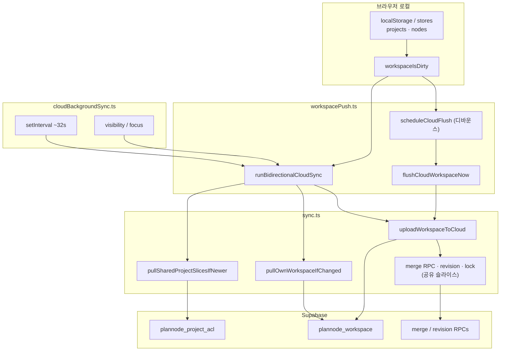

# Plannode 로컬·클라우드 동기 개요

PRD **§3 M6** · **F3-1** · **§3 M5** · **§4**와 하네스 **NOW-66~78**(모달 목록 클라우드 정본 포함)에 대응한다.  
**범위 밖(명시):** Supabase Realtime 전 구독 · CRDT · OT 수준의 미세 동시 편집 · §11 `ai_generations` 선제 배포.

---

## §1 동기 아키텍처 (NOW-66)

### 요약

- **로컬 진실:** 브라우저의 `projects` 스토어와 연관 **localStorage**에 프로젝트·노드가 먼저 반영된다 (`src/lib/stores/projects.ts` 등).
- **클라우드 행:** 사용자별 **`plannode_workspace`** 한 행에 프로젝트 목록·노드 번들이 JSON으로 올라간다 (`src/lib/supabase/sync.ts`).
- **더티 플래그:** 로컬 변경 시 **`workspaceIsDirty`** 가 켜지면, 디바운스 **`scheduleCloudFlush`** 또는 즉시 **`flushCloudWorkspaceNow`** 가 **`uploadWorkspaceToCloud`** 를 호출한다 (`src/lib/supabase/workspacePush.ts`).
- **양방향 주기:** 로그인 후 **`startCloudBackgroundSync`** 가 **`runBidirectionalCloudSync`** 를 **약 32초 간격**(`INTERVAL_MS = 32000`) 및 **`visibilitychange`·창 focus** 시 추가 실행한다 (`src/lib/supabase/cloudBackgroundSync.ts`).
- **업로드 전 안전망:** 업로드 직전 원격 `updated_at`이 로컬 캐시와 다르면 **`mergeRemoteWorkspaceBeforeUpload`** 로 원격 번들을 먼저 **LWW 성격으로 병합**한다 (`sync.ts`).
- **모달 목록 정본(NOW-70~72):** 이메일 로그인·클라우드 설정 시 프로젝트 관리 모달의 **카드 행**은 **`plannode_workspace.projects_json`** 를 먼저 읽어 순서·메타를 잡고, 아직 서버에 없는 **로컬 전용 프로젝트**(미업로드 생성분)만 뒤에 이어 붙인다. 조회 실패 시 로컬 `$projects` 로 폴백한다 (`fetchOwnWorkspaceProjectMetasForModal` · `mergeModalListCloudCanon` · `+page.svelte`).
- **저장 라운드트립 후:** 플러시·양방향 동기 직후 **`dedupeProjectsStoreByLatestUpdatedAt`** 로 동일 `id` 중복 행을 정리하고 `plannode-modal-project-list-sync` 로 모달 목록을 다시 묶는다 (`workspacePush.ts`).
- **장시간 무활동(NOW-75):** 주기 틱에서 마지막 포인터·키 입력 후 **5분 이상**이면 **`runBidirectionalCloudSync('idle-long')`** 로 표시한다 (`cloudBackgroundSync.ts`).
- **공유 프로젝트:** 다른 사용자 워크스페이스에 속한 프로젝트는 소유자 행에 **`plannode_workspace_merge_project_slice`** 등 RPC로 슬라이스 반영·**revision·lock** 경로가 따로 있다 (`sync.ts` `pushProjectSlicesToOwners`).

### 다이어그램

---

## §2 측정 절차 정본 (NOW-67)

「측정 없는 주장 금지」에 맞춰, 아래를 **최소 1회** 재현·기록한다. DevTools **Network** 탭에서 `plannode_workspace`·RPC 이름 필터, **Console**에서 `[runBidirectionalCloudSync]`·`[cloud auto]` 등 경고 문자열을 함께 본다.

| 단계 | 행동 | 기대 관측 (예시) |
|------|------|------------------|
| 1 | 로그인 후 캔버스에서 노드 제목 등을 수정해 저장 트리거 | `workspaceIsDirty` 경로로 **`scheduleCloudFlush`** 또는 탭/가시성 이벤트에 따른 **`flushCloudWorkspaceNow`** |
| 2 | 수정 직후 탭 전환 또는 짧은 대기 | 디바운스 후 **`uploadWorkspaceToCloud`** 에 해당하는 요청 |
| 3 | 약 30~35초 대기 또는 다른 탭으로 갔다가 복귀 | **`runBidirectionalCloudSync('interval')`** 또는 **`visibility` / `focus`** 이유의 동기 — Network에서 pull·merge 관련 호출 묶음 |
| 4 | (선택) 공유 프로젝트가 있을 때 저장 | `plannode_workspace_merge_project_slice` 등 및 실패 시 **`revision_stale`** / **`merge_locked`** 메시지(§3) |

기록 표(복사용):

| 시각(대략) | 트리거 추정 | Network 요약 | Console 메모 |
|------------|-------------|----------------|----------------|
| | | | |

---

## §3 다중 사용자·간극 (NOW-68)

코드 기준으로 동기는 **비실시간**이다: Realtime 구독 없이 **주기·가시성·명시적 플러시**에 의존한다.

| 현상 | 의미 | 한계 |
|------|------|------|
| **`revision_stale`** | 서버 revision이 로컬 기대보다 앞섬 | RPC가 실패하면 **`pullSharedProjectSlicesIfNewer`** 로 원격을 당긴 뒤 토스트로 안내·재시도 루프 — **즉시 합치 OT 아님** |
| **`merge_locked` / `locked_by_other`** | 동일 공유 프로젝트에 대한 merge 잠금 충돌 | 다른 멤버 업로드 중일 때 **대기·토스트** — **동시 편집 실시간 합치 아님** |
| **토스트 스로틀** (`MERGE_SLICE_WARN_COOLDOWN_MS` 등) | 같은 프로젝트에 대한 사용자 알림 과다 방지 | 사용자는 **지연·중복 안내**를 볼 수 있음 |

**정리:** 시차·충돌은 **완화(retry·pull·알림)** 수준이며, **미세 동시 편집 동기화(CRDT/OT)** 는 현재 제품 범위에서 제외된다.

---

## 참고 경로

| 파일 | 역할 |
|------|------|
| `src/lib/supabase/workspacePush.ts` | `flushCloudWorkspaceNow`, `scheduleCloudFlush`, `runBidirectionalCloudSync` |
| `src/lib/supabase/cloudBackgroundSync.ts` | ~32초 interval · visibility · focus |
| `src/lib/supabase/sync.ts` | 업로드·풀·공유 merge·revision·lock·토스트 |
| `src/routes/+page.svelte` | 플러시 스케줄 호출·백그라운드 시작 등 |
