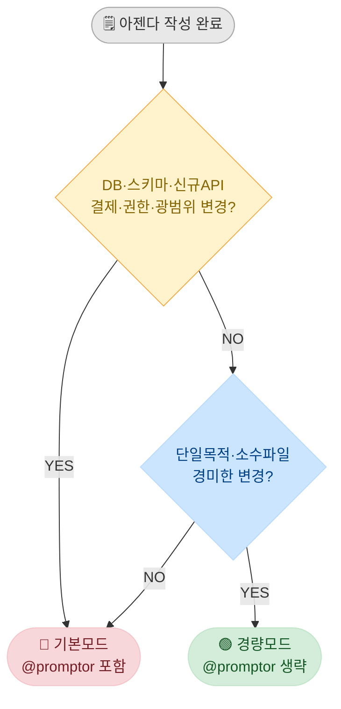
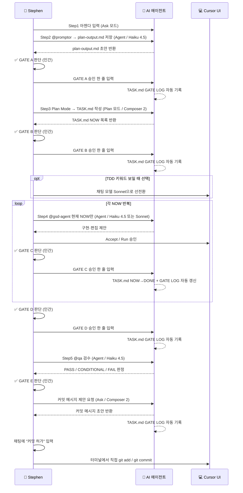
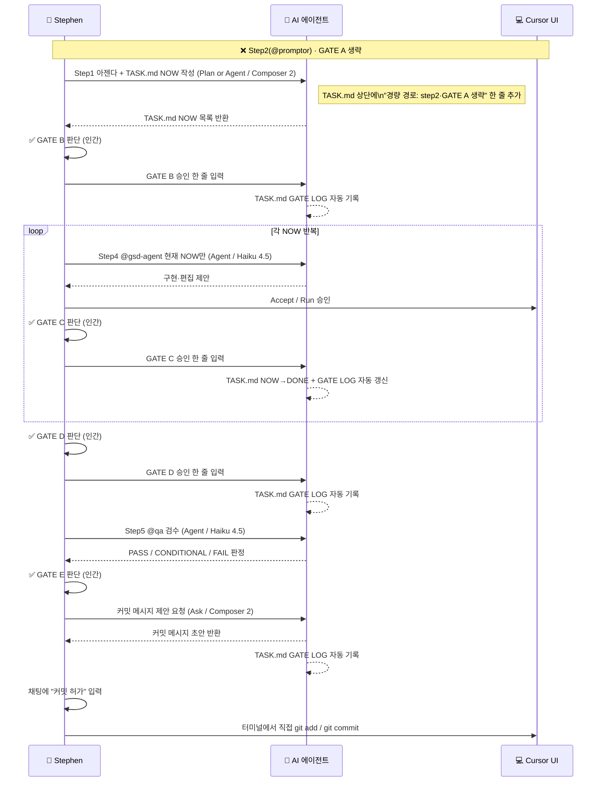
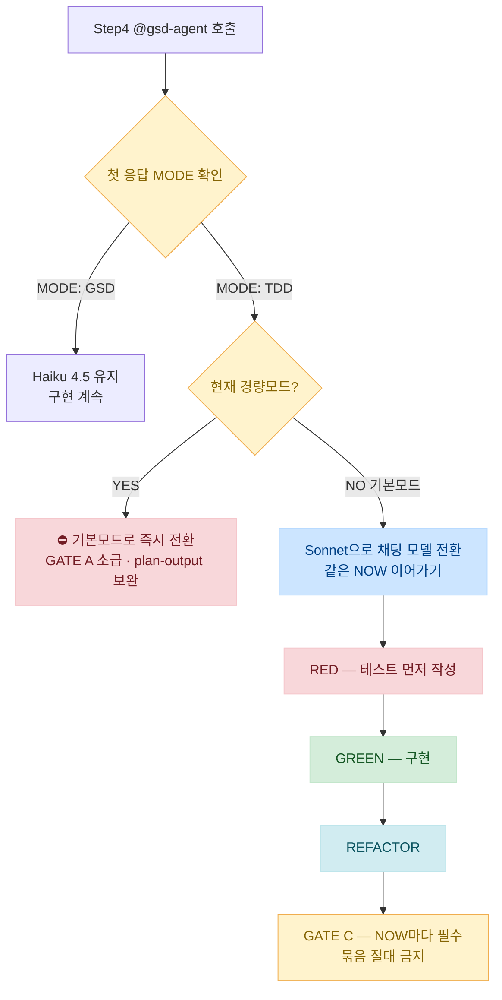
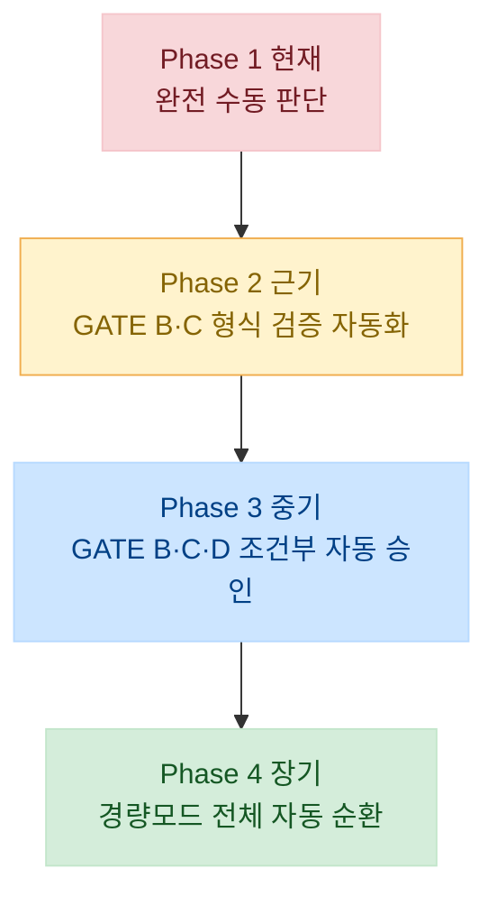

# 하네스 워크플로우 — 검토·개선안 포함 최종 레퍼런스

> **Mermaid 렌더링**: Cursor에서 `Markdown Preview Mermaid Support` 익스텐션 설치 후
> 파일 우측 상단 미리보기 아이콘 클릭 (또는 `Ctrl+Shift+V`) 하면 다이어그램이 보여.

---

## ⚠️ 발견된 문제점 + 개선안 요약

| # | 문제 | 개선 내용 |
|---|---|---|
| 1 | GATE B~D에 "Haiku 4.5" AI 모델 표기 | GATE는 인간 게이트 — 모델 표기 삭제 |
| 2 | 경량모드 Step1 모델 기준 없이 두 모델 병기 | 아젠다 복잡도 기준 명시 |
| 3 | GATE D 복붙 문장에 'OOOO' 플레이스홀더 | 간결하고 완결된 문장으로 교체 |
| 4 | 경량모드에서 TDD 나올 때 처리 기준 없음 | 즉시 기본모드 전환 명시 |
| 5 | 커밋 메시지 요청 위치 모호 | 4단계 순서 명확화 |
| 6 | GATE 승인 기록을 Stephen이 직접 기록 | 승인 판단은 👤, 기록은 🤖 AI 자동 갱신으로 분리 |

---

## ① 모드 판별 (아젠다 작성 직후)

> 아래 **하나라도 해당** → **기본모드** (경량 불가)

| 판별 신호 | 예시 |
|---|---|
| DB · 스키마 · 마이그레이션 | `scripts/migrations/`, `tables.ts`, RLS, 복잡 쿼리 |
| 신규 공개 API · 권한 · 핵심 도메인 | 계약, `work_guest`, `security-auth` 범위 |
| 결제 · 예약 · 동시성 (TDD 키워드) | TDD MODE 예상 작업 |
| 연쇄 · 광범위 변경 | 4개 이상 파일, 복수 목적 아젠다 |

> **전부 해당 없음** + 단일목적 · 소수파일 · 경미한 변경 → **경량모드 후보**



---

## ② 기본모드 (통상 경로)

### 전체 흐름 다이어그램



### 단계별 실행표 (개선 반영)

| # | 단계 | 채팅 모드 | AI 모델 | 행동 주체 | 복붙 문장 |
|---|---|---|---|---|---|
| 1 | **Step1 — 아젠다** | Ask | — | 👤 | `목표: …` `범위 밖: …` `참고 파일·화면: …` |
| 2 | **Step2 — @promptor** | Agent | **Haiku 4.5** | 🤖 | `@promptor` `위 아젠다로 분석·프롬프팅 정리하고 .cursor/harness/plan-output.md에 저장해. 코드·커밋 금지. 요약만.` |
| 3 | **GATE A** | Ask | 없음 | 👤 판단 / 🤖 기록 | 승인: `GATE A 승인. Step3(Plan Mode) 진행.` / 수정: `GATE A 수정: … plan-output 갱신해.` / 반려: `GATE A 반려. Step2부터. 아젠다 재정의: …` |
| 4 | **Step3 — Plan Mode** | **Plan** | **Composer 2** | 🤖 | `Plan Mode: .cursor/harness/plan-output.md(GATE A 확정)를 입력으로 .cursor/harness/TASK.md를 NOW/DONE 형태로 채워. 태스크는 30분 단위.` |
| 5 | **GATE B** | Ask | 없음 | 👤 판단 / 🤖 기록 | 승인: `GATE B 승인. @gsd-agent 로 현재 NOW만.` / 수정: `GATE B: TASK.md 내가 고쳤어. 순서만 확인해.` / 반려: `GATE B 반려. Step3 재실행. 이유: …` |
| 6 | **[선택] TDD 선전환** | — | **Sonnet으로 수동 전환** | 👤 | 아젠다에 결제·예약·동시성 보이면 GATE B 직후 채팅 모델 직접 전환 |
| 7 | **Step4 — @gsd-agent** | Agent | **Haiku 4.5** (GSD) / **Sonnet** (TDD) | 🤖 | `@gsd-agent` `.cursor/harness/TASK.md 현재 NOW만. 범위 밖 구현 금지. 끝나면 TASK 갱신·한 줄 요약.` |
| 8 | **GATE C** (NOW마다) | Ask | 없음 | 👤 판단 / 🤖 기록 | `GATE C 승인. 다음 NOW.` / 마지막: `GATE C 승인. 전부 끝. GATE D로.` |
| 9 | **GATE D** | Ask | 없음 | 👤 판단 / 🤖 기록 | `GATE D 승인. @qa` `변경 파일: [파일명]` `TASK.md의 아젠다 목표 기준으로 구현 검수. PASS / CONDITIONAL / FAIL 판정.` |
| 10 | **Step5 — @qa** | Agent | **Haiku 4.5** | 🤖 | `@qa` `변경 파일: …` `.cursor/rules/README.md에서 해당 도메인 규칙만 적용해 검수.` |
| 11 | **GATE E + 커밋** | Ask (Composer 2) | 없음 | 👤 판단 / 🤖 기록 | ① QA PASS 확인 → ② `커밋 메시지 제안해줘` → ③ 메시지 확인 → ④ `커밋 허가` 입력 → ⑤ 터미널 `git add` / `git commit` |

> **⚠️ 핵심 원칙**
> - GATE 판단: 항상 👤 Stephen
> - GATE 기록: 항상 🤖 AI → TASK.md GATE LOG 자동 갱신
> - Stephen이 TASK.md에 직접 기록하는 것은 없음
> - GATE B·C·D 승인만으로 커밋 자동 허가 안 됨 — 반드시 "커밋 허가" 채팅 입력 필요

---

## ③ 경량모드

### 적용 조건

- 단일 목적 · 소수 파일 · 경미한 UI 수정 · 버그 수정 수준
- 권한 · 계약 · 스키마 · 마이그레이션 · 신규 공개 API · 결제 · 동시성에 손대지 않을 때

### 전체 흐름 다이어그램



### 단계별 실행표 (개선 반영)

| # | 단계 | 채팅 모드 | AI 모델 | 행동 주체 | 복붙 문장 |
|---|---|---|---|---|---|
| 1 | **Step1 — 아젠다 + TASK.md** | Plan 또는 Agent | **Composer 2** (기본) / Haiku Thinking (간단한 TASK) | 🤖 | 아젠다 입력 후 Plan Mode로 `.cursor/harness/TASK.md` NOW 작성 + 상단 한 줄: `경량 경로: step2·GATE A 생략` |
| 2 | **GATE B** | Ask | 없음 | 👤 판단 / 🤖 기록 | 승인: `GATE B 승인. @gsd-agent 로 .cursor/harness/TASK.md 현재 NOW만.` / 직접 수정 후: `GATE B: TASK.md 내가 고쳤어. 순서만 확인하고 @gsd-agent 현재 NOW만.` |
| 3 | **Step4 — @gsd-agent** | Agent | **Haiku 4.5** | 🤖 | `@gsd-agent` `.cursor/harness/TASK.md 현재 NOW만. 범위 밖 구현 금지. 끝나면 TASK 갱신·한 줄 요약.` |
| 4 | **GATE C** (NOW마다) | Ask | 없음 | 👤 판단 / 🤖 기록 | `GATE C 승인. 다음 NOW.` / 마지막: `GATE C 승인. 전부 끝. GATE D로.` |
| 5 | **GATE D** | Ask | 없음 | 👤 판단 / 🤖 기록 | `GATE D 승인. @qa` `변경 파일: [파일명]` `TASK.md의 아젠다 목표 기준으로 구현 검수. PASS / CONDITIONAL / FAIL 판정.` |
| 6 | **Step5 — @qa** | Agent | **Haiku 4.5** | 🤖 | `@qa` `변경 파일: …` `(PASS / CONDITIONAL / FAIL 확인)` |
| 7 | **GATE E + 커밋** | Ask (Composer 2) | 없음 | 👤 판단 / 🤖 기록 | ① QA PASS 확인 → ② `커밋 메시지 제안해줘` → ③ 메시지 확인 → ④ `커밋 허가` 입력 → ⑤ 터미널 `git add` / `git commit` |

### ⚠️ 경량모드 중 TDD 나올 때 (개선안 #4)

> `@gsd-agent` 첫 응답에서 `MODE: TDD`가 나오면 → **즉시 기본모드로 전환**
> GATE A 소급 · plan-output 보완 후 재진행. 경량 상태로 TDD 계속 진행 금지.

---

## ④ 모드별 한눈 비교

```mermaid
flowchart LR
    subgraph 기본모드
        N1[Step1 아젠다] --> N2[Step2 @promptor]
        N2 --> NA[GATE A\n👤판단 🤖기록]
        NA --> N3[Step3 Plan Mode\nTASK.md 작성]
        N3 --> NB[GATE B\n👤판단 🤖기록]
        NB --> N4[Step4 @gsd-agent\nNOW 루프]
        N4 --> NC[GATE C\n👤판단 🤖기록]
        NC -->|다음 NOW| N4
        NC --> ND[GATE D\n👤판단 🤖기록]
        ND --> N5[Step5 @qa]
        N5 --> NE[GATE E\n👤판단 🤖기록\n터미널 커밋]
    end

    subgraph 경량모드
        L1[Step1 아젠다\n+TASK.md NOW] --> LB[GATE B\n👤판단 🤖기록]
        LB --> L4[Step4 @gsd-agent\nNOW 루프]
        L4 --> LC[GATE C\n👤판단 🤖기록]
        LC -->|다음 NOW| L4
        LC --> LD[GATE D\n👤판단 🤖기록]
        LD --> L5[Step5 @qa]
        L5 --> LE[GATE E\n👤판단 🤖기록\n터미널 커밋]
    end

    style N2 fill:#e8d5f5,stroke:#9b59b6,color:#4a235a
    style NA fill:#fff3cd,stroke:#f0ad4e,color:#856404
    style NB fill:#fff3cd,stroke:#f0ad4e,color:#856404
    style NC fill:#fff3cd,stroke:#f0ad4e,color:#856404
    style ND fill:#fff3cd,stroke:#f0ad4e,color:#856404
    style NE fill:#d4edda,stroke:#28a745,color:#155724
    style LB fill:#fff3cd,stroke:#f0ad4e,color:#856404
    style LC fill:#fff3cd,stroke:#f0ad4e,color:#856404
    style LD fill:#fff3cd,stroke:#f0ad4e,color:#856404
    style LE fill:#d4edda,stroke:#28a745,color:#155724
```



| 항목 | 기본모드 | 경량모드 |
|---|---|---|
| **Step2 @promptor** | ✅ 필수 | ❌ 생략 |
| **plan-output.md** | ✅ 생성 | ❌ 생략 |
| **GATE A** | ✅ 필수 | ❌ 생략 |
| **TASK.md 채팅 모드** | Plan (Step3 별도) | Plan 또는 Agent (Step1과 동시) |
| **TASK.md AI 모델** | Composer 2 | Composer 2 (기본) / Haiku Thinking (간단) |
| **GATE 판단** | 항상 👤 Stephen | 항상 👤 Stephen |
| **GATE 기록** | 항상 🤖 AI 자동 | 항상 🤖 AI 자동 |
| **@gsd-agent 기본 모델** | Haiku 4.5 | Haiku 4.5 |
| **TDD 시 모델** | Sonnet 전환 | 기본모드로 즉시 전환 |
| **GATE C** | ✅ NOW마다 (묶음 조건부) | ✅ NOW마다 (묶음 조건부) |
| **@qa 모델** | Haiku 4.5 | Haiku 4.5 |
| **GATE E** | 👤 판단 / 🤖 기록 | 👤 판단 / 🤖 기록 |
| **git commit** | 👤 터미널 직접 | 👤 터미널 직접 |

---

## ⑤ TDD 모드 전환 규칙



| 구분 | 내용 |
|---|---|
| **본질적 분기 시점** | `@gsd-agent` 첫 응답 `MODE: TDD` 확인 시 → 채팅 모델 **Sonnet으로 전환** 후 같은 NOW 이어가기 |
| **선전환 (선택)** | 아젠다에 결제·예약·동시성 키워드 보이면 GATE B 직후 미리 Sonnet 전환 가능 |
| **TDD 묶음 금지** | TDD NOW는 GATE C 묶음 불가. 무조건 NOW마다 GATE C |
| **RED 전 src/ 수정 금지** | TDD 시 RED(테스트 먼저) 없이 구현 파일 수정 제안이 오면 거절 |
| **경량 중 TDD** | 경량모드에서 TDD 나오면 → 기본모드로 즉시 전환 |

---

## ⑥ 커밋 프로세스 (명확화)

```mermaid
flowchart LR
    A[@qa 검수 완료] --> B{QA 판정}
    B -->|PASS| C[Ask 모드\n커밋 메시지 제안 요청]
    B -->|CONDITIONAL| D[변경 범위 PASS 확인\n전역 오류는 BACKLOG 처리]
    B -->|FAIL| E[Step4로 돌아가\n해당 NOW 재구현]
    D --> C
    C --> F[메시지 검토 후\n채팅에 커밋 허가 입력]
    F --> G[🤖 GATE LOG 자동 기록]
    G --> H[👤 터미널에서 직접\ngit add / git commit]

    style B fill:#fff3cd,stroke:#f0ad4e,color:#856404
    style E fill:#f8d7da,stroke:#f5c6cb,color:#721c24
    style F fill:#cce5ff,stroke:#b8daff,color:#004085
    style G fill:#e8d5f5,stroke:#9b59b6,color:#4a235a
    style H fill:#d4edda,stroke:#c3e6cb,color:#155724
```

> GATE B / C / D 승인만으로는 커밋 자동 허가 안 됨. 반드시 채팅에 **"커밋 허가"** 입력 후 본인이 직접 실행.

---

## ⑦ GATE 자동화 로드맵

> 현재는 **판단 👤 + 기록 🤖** 구조. 추후 조건 충족 시 GATE별로 자동 승인까지 단계적으로 확장.



| GATE | 현재 (Phase 1) | Phase 2 — 보조 자동화 | Phase 3 — 조건부 자동 승인 | Phase 4 — 풀 자동화 | 자동화 AI 모델 | 자동화 영구 금지 |
|---|---|---|---|---|---|---|
| **GATE A** | 👤 수동 판단·🤖 기록 | 품질 스코어 체크 보조 | — | — | Sonnet | 아젠다 범위 모호·도메인 충돌 시 |
| **GATE B** | 👤 수동 판단·🤖 기록 | NOW 형식·30분 단위 검증 | 형식 조건 전부 충족 시 자동 승인 | 경량모드 한정 자동 | Haiku | TDD·4개 이상 파일·복수 목적 시 |
| **GATE C** | 👤 수동 판단·🤖 기록 | 린트·타입·범위 자동 체크 | 전부 PASS 시 자동 승인 | 경량모드 한정 자동 | Haiku | TDD MODE·권한·스키마 변경 시 |
| **GATE D** | 👤 수동 판단·🤖 기록 | 모든 NOW DONE 여부 집계 | GATE C 전부 기록 확인 시 자동 | 경량모드 한정 자동 | Haiku | 묶음 NOW 존재 시 수동 병행 |
| **GATE E** | 👤 수동 판단·🤖 기록 | QA PASS 자동 판정 보조 | QA PASS + CONDITIONAL 이하 시 | — | Sonnet | **커밋 실행은 영구 수동** |
| **git commit** | 👤 터미널 직접 | — | — | — | — | **영구 자동화 금지** |
| **DB 스키마 적용** | 👤 터미널 직접 | — | — | — | — | **영구 자동화 금지** |

### 자동화 황금 원칙

```
✅ 자동화 가능     → 형식 검증, 범위 확인, 상태 집계, GATE 승인 기록
✅ 조건부 자동화   → GATE B·C·D 승인 (경량모드 + 조건 명확할 때)
❌ 자동화 금지     → git commit·push 실행
❌ 자동화 금지     → DB 스키마 적용 (psql 실행)
❌ 자동화 금지     → 보안·권한 로직 판단
❌ 자동화 금지     → 기본모드 GATE A·E 최종 판단
```

---
---
---

# 📎 참고 — 부연 정보 (기술적 · 의미적 · 구현 의도)

## 기준 문서 위치

| 파일 | 역할 |
|---|---|
| `AGENTS.md` (루트) | Cursor 자동 로드. `.cursor/harness/AGENTS.md`와 동일 본문 |
| `.cursor/harness/README.md` | 토큰 절약·폴더 역할·DB 절 |
| `.cursor/harness/context-hook.md` | `@gsd-agent` STEP 0, HOOK-1~5, 명령 충돌 처리 |
| `.cursor/agents/gsd-agent.md` | step4 실행, STEP 0·1·1.5(TDD·UI·HOOK), 실행 패키지 |
| `.cursor/agents/qa.md` | 판정 스코프·GATE E 연동 |

---

## 하네스 구조 상세

| 구분 | 내용 |
|---|---|
| **폴더 역할** | `.cursor/agents/` — 서브 에이전트 정의. `.cursor/harness/` — 인간 게이트용 산출물·헌법 |
| **규칙** | `.cursor/rules/core-rules.mdc` — `alwaysApply: true`로 세션에 반영 |
| **토큰** | step마다 필요한 파일만 `@` 첨부. 하네스 전체 일괄 첨부 지양 |
| **@gsd-agent 모델** | 기본 `haiku`. TDD 시 Sonnet 전환 권장 |
| **Step3** | Cursor Plan Mode가 `.cursor/harness/TASK.md`를 채우는 흐름이 헌법상 핵심 |

---

## 통상 경로 — DB·마이그레이션 절차

- **패턴**: `schema-change-history.mdc`, `.cursor/harness/README.md` DB 절
- **원칙**: 이미 커밋된 마이그레이션 SQL 임의 수정 금지 → **신규 파일 추가**
- **실행**: `psql` / Supabase CLI — 👤가 터미널에서 직접 (AI 자율 실행 금지)

---

## GATE C 묶음 불가 조건

- `MODE: TDD` 해당 NOW
- 권한·스키마·HOOK-5 진행 중
- 묶는 항목이 같은 라우트·같은 UX 의도가 아닐 때

---

## 에이전트 정의 파일

| 에이전트 | 정의 파일 |
|---|---|
| promptor | `.cursor/agents/promptor.md` |
| gsd-agent | `.cursor/agents/gsd-agent.md` |
| qa | `.cursor/agents/qa.md` |
