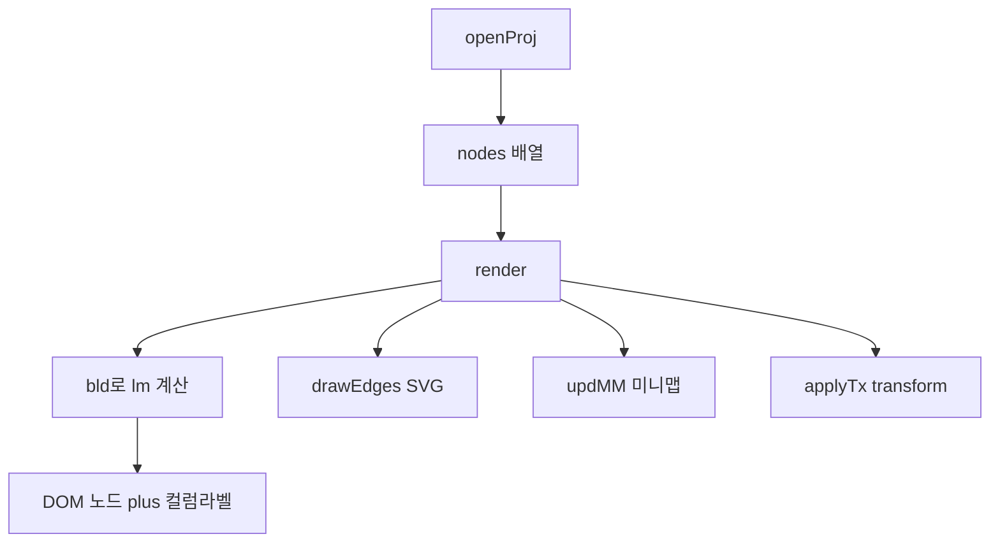

# Plannode 파일럿 기능 분해·개발 명세

**대상:** `http://localhost:8000/` (Vanilla JS) — [index.html](../index.html) + [plannode.js](../plannode.js)  
**목적:** SvelteKit 등 후속 구현 시 **동일 기능·동일 UX**를 재현하기 위한 단일 참조 문서  
**소스 기준:** 저장소 내 파일 기준 (실행 URL은 로컬 서빙에 따름)

**트리뷰 보호 (포팅·스타일 공통):** 본 문서의 **DOM 계약**·**캔버스·노드 동작**은 Plannode **핵심 제품 기능**(트리뷰 노드 작성·트리 구조)의 기준이다. SvelteKit·CSS·부가 뷰 작업 시 `AGENTS.md` **GP-13**·**「트리뷰 핵심 보호 헌장」**·`.cursor/rules/plannode-core.mdc`를 따르고, §1.1의 `.view` 전환·`#CV`/`#EG` 관계를 **저해·가림**하지 않는다.

---

## 1. 파일럿 전역 상태 및 노드 데이터 모델

### 1.1 DOM 루트 계약 ([index.html](../index.html))

| ID / 요소 | 역할 |
|-----------|------|
| `#R` | 앱 루트 (모달·토스트·컨텍스트 메뉴 포함) |
| `#TB` | 상단 바 (탭, 출력 버튼, 프로젝트 `+`) |
| `#VIEWS` / `.view` | `tree` / `prd` / `spec` / `ai` 뷰 전환 (`active` 클래스) |
| `#CW` | 캔버스 래퍼 (휠·패닝 영역) |
| `#CV` | **줌/패닝 transform 적용 대상** (`transform-origin: 0 0`) |
| `#EG` | SVG 간선 레이어 (`#CV` 내부, `pointer-events: none`) |
| `#ES` | 프로젝트 미선택 시 빈 화면 (열기 유도) |
| `#CTX` | 우클릭 컨텍스트 메뉴 |
| `#TST` | 토스트 |
| `#PM` | 프로젝트 모달 |
| `#MMC` / `#MMV` | 미니맵 캔버스 / 뷰포트 오버레이 |
| `#ZI` / `#ZO` / `#ZP` | 줌 인/아웃, 줌 % 표시 |

**레이어 순서(논리):** 컬럼 라벨(`.cp`) → 노드 래퍼(`.nw`) → SVG는 `#CV` 안에서 노드와 함께 스케일됨.

### 1.2 전역 상태 ([plannode.js](../plannode.js) L12–L14)

| 심볼 | 의미 |
|------|------|
| `projects` | 프로젝트 배열 |
| `curP` | 현재 프로젝트 |
| `nodes` | **플랫** 노드 배열 (트리는 `parent_id`로 표현) |
| `lm` | 레이아웃 맵 `{ [nodeId]: { col, row } }` — `render()`마다 재계산 |
| `scale`, `panX`, `panY` | 카메라(줌/패닝) |
| `panning`, `ps` | 빈 캔버스 드래그 패닝 상태 |
| `selId` | 선택 노드 ID |
| `nc` | ID 카운터 (`n` + 숫자, `p` + 숫자 등) |
| `ctxOpen` | 컨텍스트 메뉴 열림 여부 (외부 클릭 닫기) |
| `curView` | `'tree' \| 'prd' \| 'spec' \| 'ai'` |

### 1.3 상수·유틸 (L1–L10, L40–L57)

- **색/라벨:** `DC` 깊이별 색, `DN` 컬럼 한글 라벨, `BTYPES` / `BCLS` / `ON` / `OFF` / `bl()` 배지 UI
- **격자:** `COL_W = 244`, `ROW_H = 122`
- **`esc(s)`** — HTML 이스케이프 (모달·PRD 등)
- **`toMdLine`** — PRD용 마크다운 트리; **순환 `parent_id` 방지**(`path` Set), **깊이 상한** `_MD_DMAX` (스택/indent 폭주 방지)

### 1.4 노드 객체 스키마 (런타임)

파일럿에서 실제로 쓰이는 필드 (예: `addChild` L168–L174, `openProj` L264–L267):

| 필드 | 타입 | 설명 |
|------|------|------|
| `id` | string | 고유 ID (`n` + `nc`) |
| `parent_id` | string \| null | 루트는 `null` |
| `name`, `description` | string | 표시·편집 |
| `num` | string | 계층 번호 (예 `1`, `1.2`) |
| `badges` | string[] | `tdd`, `ai`, `crud`, `api`, `usp` |
| `node_type` | string | `root` / `module` / `feature` / `detail` (깊이에 따른 기본값) |
| `mx`, `my` | number \| null | **수동 배치**; `null`이면 자동 격자 위치 사용 |

**영속화:** 파일럿은 **localStorage를 사용하지 않음** — 새로고침 시 메모리 상태만 유지(초기 시드 프로젝트는 L295–L299).

### 1.5 프로젝트 객체

생성 시 (L291): `{ id, name, author, start_date, end_date, description }`  
데모 `s1`만 `getDemoNodes(pid)`로 대량 노드 로드 (L251–L263, L266).

---

## 2. 자동 레이아웃 엔진 (`bld`, `ap`, `gp`)

### 2.1 `bld(nid, col, r)` (L115)

- `nodes`에서 `parent_id === nid`인 자식 목록을 구함.
- **자식 없음:** `lm[nid] = { col, row: r }`, 반환값 `r + 1` (다음 행 소비).
- **자식 있음:** 각 자식에 대해 `bld(child.id, col+1, row)`로 재귀; 부모 행은 `(첫 자식 시작행 + 마지막 반환행 - 1) / 2`로 **수직 중앙 정렬**.

### 2.2 루트 시드 (L119–L120)

- `lm = {}` 후 `parent_id` 없는 노드를 순회하며 `bld(root.id, 0, r)` 호출.
- 두 번째 이후 루트는 `Object.keys(lm).length`를 시작 행으로 써 **세로로 분리**.

### 2.3 `ap(id)` (L116)

- `lm[id]` → 픽셀: `x = col * COL_W + 28`, `y = row * ROW_H + 30`.

### 2.4 `gp(n)` (L117)

- `n.mx != null && n.my != null`이면 **수동 좌표** `{ x: n.mx, y: n.my }`.
- 아니면 `ap(n.id)` **자동 좌표**.

### 2.5 노드맵 배치 모드 (`right` · `topdown`)

- **`nodes` 트리 데이터와 무관**(SSoT 아님). 브라우저 `localStorage` 두 키로 구분한다.
  - **`plannode.nodeMapLayout`** — 현재 캔버스(파일럿) 배치. 루트 노드 우클릭 메뉴·생성 직후 적용 등으로 갱신.
  - **`plannode.nodeMapLayoutNewProjectDefault`** — 프로젝트 관리 모달에서만 설정하는 **다음 새 프로젝트 생성 시** 기본 배치. 모달에서 옵션을 고른다고 **이미 열린 프로젝트 캔버스는 바뀌지 않음**; **`+ 프로젝트 생성`** 완료 후 새 프로젝트가 열릴 때 그 값이 파일럿에 적용된다.
- **우측분포 (`right`):** 기본. §2.1 `bld` — 깊이마다 가로 열 증가, 간선은 부모 카드 **오른쪽 중앙**에서 자식 **왼쪽**으로(§6).
- **하위분포 (`topdown`):** `bldTopDown` — 깊이는 세로 행(`row`), 형제는 가로(`col`)로 펼침; 간선은 부모 **아래쪽**에서 자식 **위쪽**으로.

---

## 3. 렌더링 파이프라인 및 DOM 생성

### 3.1 `render()` (L119–L145)

1. 레이아웃 맵 재계산 (`lm`, `bld`).
2. `#CV` 내 `.nw`, `.cp` 제거; `#EG` 비우기.
3. 최대 열 `mc`로 컬럼 라벨 `.cp` 생성 (텍스트는 `DN[i]`).
4. 각 노드:
   - 래퍼 `.nw` (`#nw-{id}`), 위치 `gp(n)`의 `left/top`.
   - 카드 `.nd` — 루트는 `.rnd`(폭 168px), 선택 시 `.sel`.
   - 내용: 색봉 `.nb`, 이름+`L{depth}`, 설명, 배지, 번호, 액션 영역 `#na-{id}`.
   - **좌클릭 드래그:** `mousedown` (button 0, `.na` 제외) → `selId`, `sDrag`.
   - **우클릭:** `contextmenu` → `showCtx`.
   - 액션: `mkB('+ 추가')` → `addChild`; 부모 있으면 `mkB('✕ 삭제')` → `cDel`.
   - **우측 원형 `+` 버튼** `.pb2` — `mousedown` stopPropagation 후 `click`에서 `addChild`.
5. `drawEdges()` → `updMM()` → `applyTx()`.
6. `curView === 'prd'|'spec'`이면 `buildPRD` / `buildSpec`.

### 3.2 빈 상태 `#ES` (L267, index L147–L151)

- `openProj` 성공 시 `ES.style.display = 'none'`으로 숨김.
- 프로젝트 없을 때만 표시 (초기 UX).

---

## 4. 상호작용 시스템

### 4.1 노드 드래그 `sDrag(e, n)` (L162–L167)

- 시작: `sx = (clientX - panX)/scale - p.x` (노드 로컬 기준).
- **이동 중:** `n.mx`, `n.my` 갱신; `#nw-{id}`의 `left/top`만 갱신; **`drawEdges()` + `updMM()`** — 전체 `render()` 아님.
- **mouseup:** 리스너 제거 후 **`moved`일 때만 `render()`** 재호출.

### 4.2 자식 추가 `addChild(pid)` (L168–L176)

- 형제 수로 `num` 계산: 부모 `num`이 있으면 `p.num + '.' + (kids+1)`, 없으면 `kids.length+1`.
- 깊이 `d = getDepth(pid)`로 `node_type` 매핑 (`module`/`feature`/그 외 `detail`).
- `nodes = [...nodes, nn]` 후 `render()`, 이중 `rAF`로 **`showEdit(nn)`** 자동 오픈.

### 4.3 삭제 `cDel(id)` (L177–L183)

- `gAll`로 자기+하위 전체 ID 수집.
- `showIM`으로 확인 모달 → 확인 시 필터링 후 `render()`.

### 4.4 편집 `showEdit(n)` (L184–L200)

- `showIM` + 배지 토글 콜백; 저장 시 DOM에서 `.ein`/`.eid`/`.einum` 읽어 반영, `nodes` 스프레드 후 `render()`.

### 4.5 컨텍스트 `showCtx(e, n)` (L208–L220)

- 항목: 편집, 하위 추가, 배지 구역, 위치 초기화(`mx/my=null`), (부모 있을 때만) 삭제.
- 위치는 `#R` 기준 좌표 + 뷰포트 클램프 (`rAF`).

### 4.6 컨텍스트 클릭 라우팅 (L221–L228)

- `#CTX` 내부 `data-a`에 따라 분기; 외부 클릭 시 닫기.

---

## 5. 줌·패닝 및 카메라 제어

### 5.1 Transform 적용 `applyTx()` (L229)

- `#CV.style.transform = translate(panX, panY) scale(scale)`.
- `#ZP` 퍼센트 갱신, `updMM()` 호출.

**중요:** 간선 SVG `#EG`는 `#CV` **내부**이므로 노드와 **같은 transform**을 공유 — 줌 시 엣지·노드 정합 유지.

### 5.2 빈 캔버스 패닝 (L242–L244)

- `mousedown` 타겟이 `CW` / `CV` / `EG`일 때만 `panning=true`.
- `mousemove`에서 `panX/Y` 누적, `applyTx()`.

### 5.3 휠 (L245–L248, `{ passive: false }`)

- **`Shift` 또는 `Ctrl` + 휠:** 줌 — 포인터 기준 `panX/panY` 보정, `scale` clamp **0.12 ~ 3**.
- **그 외 휠:** `panX -= deltaX`, `panY -= deltaY` (트랙패드 팬).

### 5.4 버튼 줌 (L249–L250)

- `#ZI` / `#ZO` — 약 1.15 / 0.87 배율, 동일 clamp.

### 5.5 전체 맞춤 `fitToScreen` (L93–L99)

- 모든 노드 `gp(n)` 바운딩 박스 → `scale` 및 `panX/panY`를 `#CW` 크기에 맞게 계산 (상한 1.2, 하한 0.15).

---

## 6. SVG 간선 렌더링 (`drawEdges`)

### 6.1 알고리즘 (L147–L160)

- 매 호출마다 `#EG` 초기화 후 `defs` + `marker#ar` 재생성.
- 각 부모 `n`에 대해 `parent_id === n.id`인 자식 `c`마다:
  - `pp = gp(n)`, `cp = gp(c)`, `d = getDepth(n.id)`.
  - **출발 너비** `pw = d===0 ? 168 : 188` (루트 카드 폭과 일치).
  - 베지어: `M x1,y1 C mx,y1 mx,y2 x2,y2` — `x1=pp.x+pw`, `y1=pp.y+44`, `x2=cp.x`, `y2=cp.y+44`, `mx=(x1+x2)/2`.
  - `stroke = getDC(d)+'66'`, `marker-end=url(#ar)`.

### 6.2 깊이 `getDepth(id)` (L19)

- `parent_id` 체인 따라 올라가며 깊이 계산; 방문 Set으로 순환 시 0 처리.

---

## 7. 부가 뷰·출력·프로젝트

### 7.1 탭 전환 (L21–L31)

- `.vtab` 클릭 → `curView`, 뷰 `active`, PRD/Spec이면 빌드.

### 7.2 PRD / Spec / AI

- **PRD** `buildPRD` (L58–L67): 메타, `toMdLine` 트리, TDD/AI 배지 섹션.
- **Spec** `buildSpec` (L68–L76): `num` 정렬 테이블.
- **AI** `triggerAI` (L78–L87): `getTreeText()` 기반 프롬프트 문자열 — 현재는 UI 스텁.

### 7.3 MD / PRD 파일 다운로드 (L100–L113)

- `dlFile` + Blob; 트리/표는 `toMdLine` 및 정렬 노드 반복.

### 7.4 프로젝트 모달 (L264–L293)

- `openProj`: `curP` 설정, 모달 닫기, 노드 로드(데모 vs 단일 루트), `render` + `renderCards`.
- `BCR`: 유효성 검사 후 `projects` 앞에 추가, `openProj`.

---

## 8. 데이터 흐름(요약)

상호작용: **줌/패닝** → `applyTx`만; **노드 드래그 중** → 엣지+미니맵; **드래그 종료·구조 변경** → `render`.

---

## 9. 현재 SvelteKit 구현 대비 파일럿(갭 분석)

근거 파일: [src/lib/components/Canvas.svelte](../src/lib/components/Canvas.svelte), [src/lib/stores/projects.ts](../src/lib/stores/projects.ts), [src/routes/+page.svelte](../src/routes/+page.svelte).

| 영역 | 파일럿 동작 | SvelteKit 현황 | 리스크/버그 |
|------|-------------|-----------------|-------------|
| Transform 범위 | `#CV`에만 `transform` → **SVG+노드 동시 스케일** | `canvas-content`에만 transform, SVG는 형제 레이어일 수 있음 | **줌 시 노드·간선 좌표계 불일치** 가능 |
| 빈 노드 후 첫 추가 | 항상 루트 1개 존재 (`openProj`) | `createProject`가 `plannode_nodes_v3_{id}`에 **`[]` 저장** (L92–L94) | `selectProject`가 `stored` truthy로 **`[]`만 로드** → 루트 자동 생성 분기(L46–L58) **미실행** → **노드 0개 고착** |
| 첫 노드 버튼 | 프로젝트 ID로 자식 추가 없음 | `addNodeChild($currentProject.id)` (Canvas L649) | 부모는 **노드 id**여야 함 — **항상 실패** |
| `addNode` 이중 ID | — | `addNodeChild`가 id를 넣고 `addNode`가 **새 id 덮어씀** (store L106–L110) | 클라이언트가 넘긴 `parent_id`와 **실제 노드 id 불일치** 가능 |
| `canvasContainer` | 드래그 좌표에 사용 선언 | `bind:this` 없음 (L11 선언만) | **undefined rect** → 드래그 좌표 오류 |
| 미니맵 | `updMM` + `#MMV` 뷰포트 | 별도 컴포넌트 존재하나 트리 뷰에 **미통합** 가능 | 파일럿과 UX 불일치 |
| PRD/Spec | `render` 후 동기 빌드 | 정적 placeholder 텍스트 | 탭 전환 시 **데이터 미반영** |
| 헤더 맞춤 | `#BFT` → `fitToScreen` | 버튼 id만 동일, **핸들러 미연결** 가능 | 기능 누락 |
| 컨텍스트 배지 | 파일럿은 메뉴 내 토글 | Svelte 메뉴는 편집/추가/초기화/삭제만 (구현 시점 기준) | **배지 UX 차이** |

위 표는 “구현 실패/노드 생성 불가”를 재현 가능한 **스토어·UI 계약 불일치**로 귀결시키는 검증 체크리스트로 사용한다.

---

## 10. 포팅 검증 체크리스트 (기능 단위)

- [ ] 프로젝트 생성 직후 **반드시** 루트 노드 1개가 `nodes`에 존재하거나, `localStorage`에 `[]`가 아닌 시드가 저장되는가?
- [ ] “첫 노드 추가”는 **루트 노드 id**를 부모로 `addChild` 하는가?
- [ ] `addNode`는 호출자가 준 `id`를 유지하는가, 아니면 생성 후 반환 id로만 트리를 갱신하는가?
- [ ] 줌 transform이 **노드 DOM과 SVG 간선**에 동시에 적용되는가?
- [ ] `Shift/Ctrl+휠` 줌, 일반 휠 패닝, 빈 영역 드래그 패닝이 파일럿과 동일한가?
- [ ] `addChild` 직후 편집 모달 자동 오픈 여부(제품 요구사항에 맞출지 결정)
- [ ] PRD/Spec/AI 탭이 `nodes`·`curP` 변경 시 동기 갱신되는가?

---

## 11. 문서·계획 항목 대응표

| 계획 To-do | 본 문서 섹션 |
|------------|----------------|
| analysis-1 | §1 |
| analysis-2 | §2 |
| analysis-3 | §3 |
| analysis-4 | §4 |
| analysis-5 | §5 |
| analysis-6 | §6 |
| analysis-7 | §9–§10 |

---

*본 문서는 파일럿 소스 분해 결과이며, `.cursor/plans` 내 계획 파일은 수정하지 않았다.*
